# [project2-the-countdown](https://louiseskinner01.github.io/project2-the-countdown)

Developer: Louise Skinner ([Louiseskinner01](https://www.github.com/Louiseskinner01))

## The Countdown
The Countdown Game is a web-based recreation of the classic British Channel 4 TV quiz show Countdown. The Countdown is designed to play on both desktop and mobile browsers, and offers a clean but fun user experience. 
The game challenges players by generating a set of random numbers along with a target number. 

The player must use their arithmetic problem-solving skills to solve the target, using the given set of random numbers and any results from calculations made during the game and numbers can only be used once! The user can however, undo their previous input and this will free up those numbers making them available to use again. It’s a time-based, single-player experience that combines fun with cognitive skill-building.

The project aims to deliver a sleek, responsive interface with an engaging user experience, complete with a real-time countdown timer, used number tracking, and validation of answers. The game is ideal for casual play and educational purposes alike.

The rationale behind this project is to develop a browser-based game that encourages mental agility, problem-solving, and quick thinking — skills that are often underrepresented in typical casual games. Inspired by the enduring popularity of the Countdown show, this web app provides an accessible version of the game without requiring installation or login.

From a development perspective, this project serves as a practical application of web development fundamentals, including DOM manipulation, a timer, responsive design, and user input validation. It also presents features like device orientation handling — bettering the user experience.

**Site Mockups**
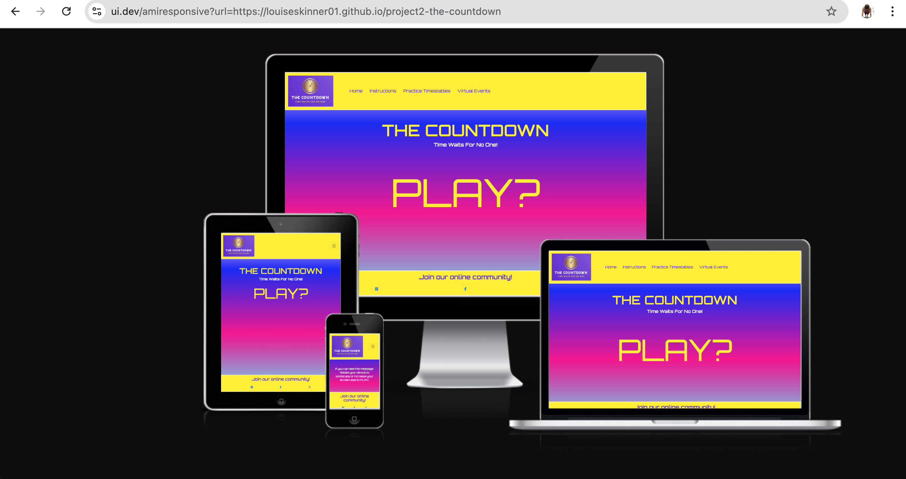

source: [project2-the-countdown amiresponsive](https://ui.dev/amiresponsive?url=https://louiseskinner01.github.io/project2-the-countdown)
## UX

### The 5 Planes of UX
#### 1. Strategy

**Purpose**
- Provide users with a simple, accessible, and enjoyable way to perform mathematical operations.
- Deliver instant feedback to reinforce learning and make the experience interactive.
- Support accessibility through clear design, responsive layouts, and intuitive controls.

**Primary User Needs**
- Perform calculations quickly and accurately without unnecessary steps.
- Understand mistakes easily and learn from feedback.
- Track performance and progress to feel motivated and engaged over time.
- Enjoy a game-like experience rather than just a static calculator.

**Business Goals**
- Encourage repeat engagement by blending education with fun.
- Showcase an accessible, well-structured tool that demonstrates strong UX principles.
- Position the app as both a learning aid and a casual game to broaden appeal.
- Build a foundation that could later expand into new features (leaderboards, multiplayer challenges, etc.).
#### 2. Scope

**[Features](#features)** (see below)
- Interactive number and operator inputs with built-in keypad.
- Random number and target generation for a challenge-based mode.
- Difficulty settings with adjustable timers.
- Error detection with clear, user-friendly messages.
- Feedback system that tracks correct and incorrect equations.
- Visual styling that reinforces the theme (e.g., “Countdown” style).

**Content Requirements**
- Clear and consistent labels for all buttons and interactive elements.
- Instructions and guidance within the console to reduce confusion.
- Prominent display of results, error states, and remaining time.
- Accessibility considerations: high-contrast colours, legible fonts, and responsive design for mobile/desktop use.

#### 3. Structure

**Information Architecture**
- **Navigation Menu**:
   - Navigation Menu: Minimalist navbar with clear links to Home, Instructions, Timestables Practice, and Virtual Events.
   - Main Game Console: Central focus with difficulty selection, number generation, and results area.
  - Supporting Elements: Timer display, user feedback (errors or successes), and controls positioned logically beneath the console.
- **Hierarchy**:
  - Key interactions (inputs, operators, results) placed across the center of the screen for visibility.
  - Secondary elements (difficulty options, instructions) appear before gameplay.
  - Feedback messages styled to stand out.

**User Flow**
1. User lands on the homepage and is presented with a screen rotate message or a clickable text "PLAY?" .
2. Rotates/increases screen size or clicks Play?, chooses difficulty, and generates numbers.
3. Works through equations using the set of random numbers, the keypad and the input.
4. Instantly sees whether the attempt is correct or not.
5. Timer runs out or target is met → user gets feedback and can restart.

#### 4. Skeleton

**[Wireframes](#wireframes)** (see below)

#### 5. Surface

**Visual Design Elements**
- **[Colours](#colour-scheme)** (see below)
- **[Typography](#typography)** (see below)

### Colour Scheme

The colour palette was designed to balance energy, clarity, and playfulness, supporting both usability and visual excitement for the player:

**Main Theme**  #4d05f6 (Deep Purple/Blue) -
This is used consistently for text and the keypad once in-play. Purple is bold and energetic, while still being easy on the eyes. It provides strong contrast against the lighter background and gives the game a modern, tech-inspired aesthetic.

**Sub Theme**  #ffef08 (Bright Yellow) -
This acts as the primary accent colour. Yellow conveys urgency and draws attention, making it ideal for interactive elements like buttons, titles, and the console "PLAY?" prompt. It reinforces the game’s competitive and time-based nature by injecting vibrancy.

**Feature** deeppink (Deep Pink)-
Pink is used sparingly for standout features such as headings and heading backgrounds. It's striking and goes well with the pinks in the bodies gradient background. 

**Calm**  #ffffff (White) -
White provides a neutral balance to the bold theme and is used for backgrounds, ensuring that text and game elements remain legible. This introduces variety and visual cleanliness. It also adds a playful, fun edge to balance the intensity of the purple and yellow.

**Background Gradient** 
The page background is styled with a linear gradient that flows from soft pastel pinks (#feddfc) into deep blues (#1717f6), vivid magentas (#f40590), and bright sky tones (#67dcf0). This gradient was chosen to create a sense of depth and progression, evoking the feeling of moving through different "levels" of the game. It also makes the environment more immersive and engaging, giving the interface a playful, almost arcade-like atmosphere while still keeping readability intact.

Overall, the palette combines high contrast for readability, bright accents for engagement, and a gradient backdrop to establish a playful yet immersive mood. This ensures the game feels both exciting and approachable while keeping the focus on solving the puzzle. 

I used [coolors.co](https://coolors.co/palette/4d05f6-ff1493-ffffff-ffef08) to generate my colour palette.

- `#4d05f6`  --main-theme-color.
- `#ffef08`  --sub-theme-color.
- `deeppink`  --feature-color.
- `#ffffff` --calm-color.

### Typography

The typography was selected to reflect both the futuristic arcade feel of the game and the clarity needed for puzzle-solving. The fonts have been imported from Google Fonts and have been used in the following way:

**Main Font – Orbitron (Sans-serif)** 
Orbitron is a geometric, futuristic typeface that immediately evokes the feeling of technology and digital displays. It’s used across the main interface to give the game a bold, modern identity while also being highly legible.

**Sub Font – Scope One (Serif)** 
Scope One provides contrast as a softer, more traditional serif font. It’s used in secondary headings and text to balance Orbitron’s sharp edges with a touch of readability and elegance. This contrast helps establish hierarchy in the design.

**Working Grid Font – Libre Franklin (Sans-serif)** 
Libre Franklin is applied to the working-out grid and keypad. It’s a clean, highly legible sans-serif that makes input fields and number interactions easy to read during gameplay. Its neutrality ensures the focus stays on solving equations, while still harmonizing with the more stylistic fonts.

Together, these fonts combine futuristic energy (Orbitron), clarity for calculations (Libre Franklin), and balance through traditional contrast (Scope One). This mix reinforces the game’s identity as both playful and puzzle-driven.

Instead of sticking to a single font, I intentionally combined three typefaces to give the game a unique personality while still prioritizing readability.
This mix avoids monotony, keeps the design visually interesting, and makes sure that both the thematic elements and functional aspects of the game are well supported.

## Wireframes

To follow best practice, wireframes were developed for mobile, tablet, and desktop sizes.
I've used [Balsamiq](https://balsamiq.com/wireframes) to design my site wireframes.

| Page | Mobile (landscape & portrait)  Tablet Desktop |
| --- | --- |
| Home (index.html) | 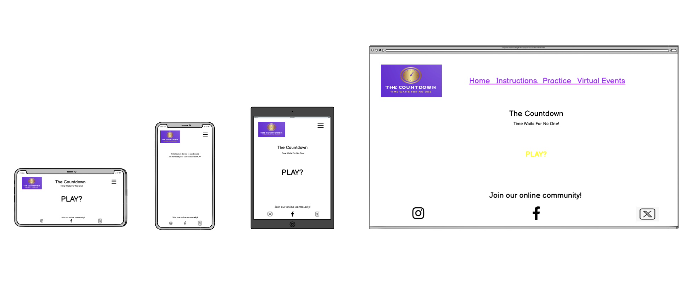 |
| Home - During Play (index.html) | 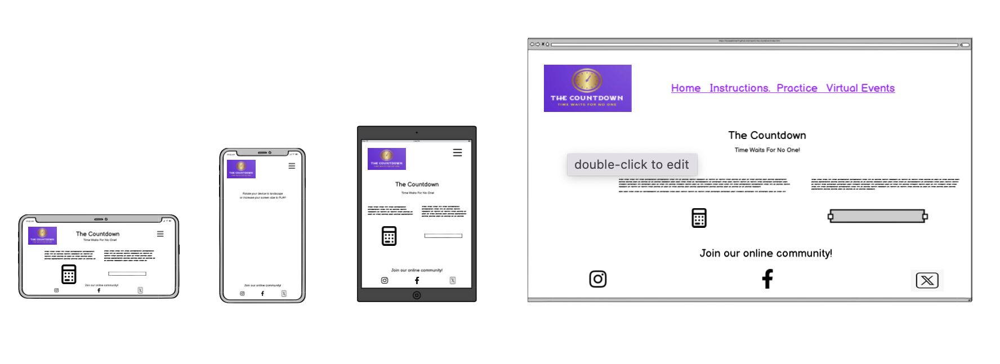 |
| 404 Error (404.html)| 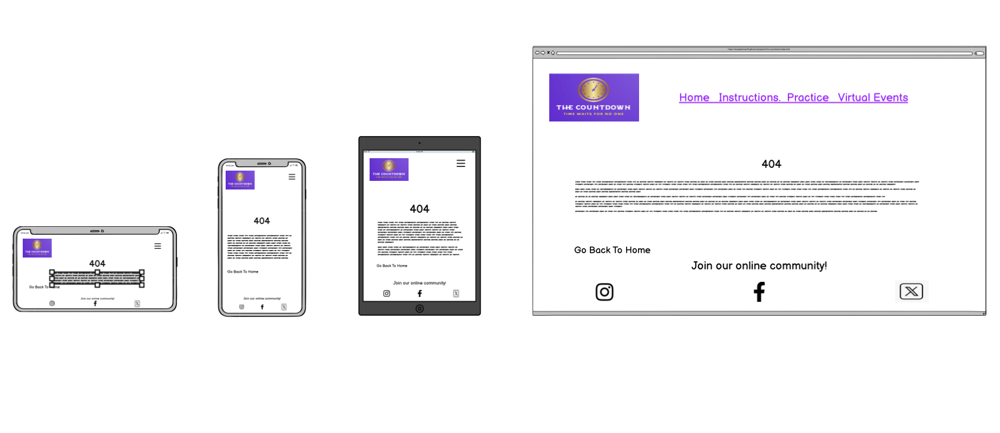 | |  |
| Virtual Events (registration.html) | 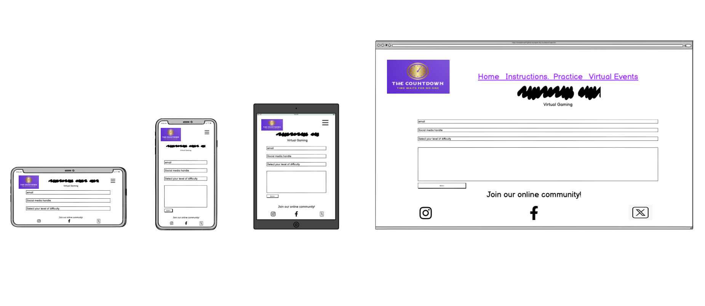 |  |  |
| Practice Timestables (practice.html) | 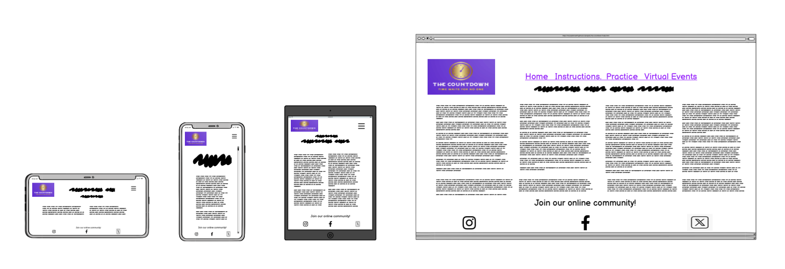 |  |  |
| Instructions (instructions.html) | 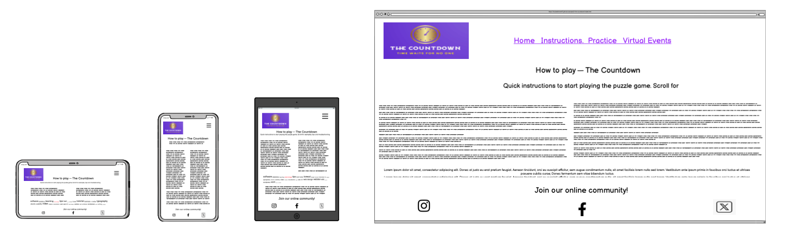 |
| Confirmation (form-submitted.html) | 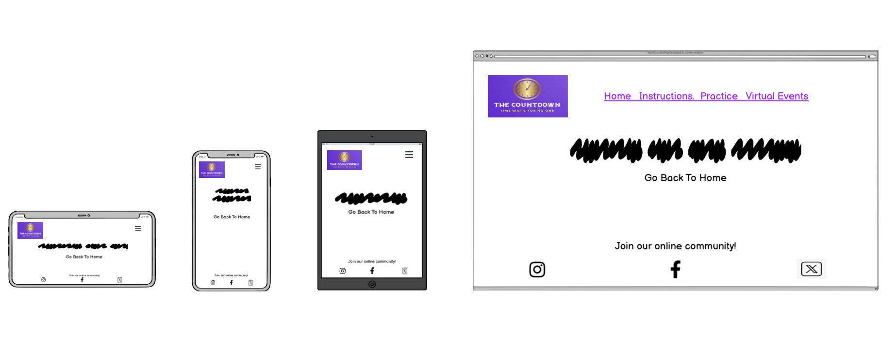 |  |  |

## User Stories
### General Play

| Target | Expectation | Outcome |
| --- | --- | --- |
| As a user | I want to start the game only when my device is in landscape mode | so that I can play with a clear and consistent layout |
| As a user | I want to choose a difficulty level | so that I can play at my preferred challenge and time limit. |
| As a user | I want to see a countdown timer, | so that I know how much time I have left to solve the problem. |
| As a user | I want to generate a random set of numbers | so that every game feels different and fresh. |
| As a user | I want to be given a target number | so that I know what I’m aiming for in my calculations. |
| As a user | I would like clear labels and instructions | so that I understand how to play the game without confusion. |
| As a user | I want to be given a target number | so that I know what I’m aiming for in my calculations. |
| As a user |  I want the game to validate my equations | so that I don’t waste time with invalid inputs. |
| As a user | I want to undo a calculation step | so that I can correct mistakes without restarting the whole game. |
|As a user | I want instant feedback when I reach the target | so that I know I’ve won.|
|As a user | I want to see a "Play Again" option after finishing a game | so that I can quickly start a new game without having to navigate via the nav-links or back buttons. |
| As a user | I would like to see a 404 error page if I get lost | so that it's obvious that I've stumbled upon a page that doesn't exist. |

### Accessibility & Usability

| Target | Expectation | Outcome |
| --- | --- | --- |
| As a visually impaired user | I want clear colour contrasts (e.g. bold backgrounds and bright highlights) | so that I can see buttons and numbers more clearly. |
| As a user with little maths knowledge| I want helpful error messages | so that I understand what I did wrong. |
| As a mobile user | I want large, tap-friendly buttons | so that I can play easily on my phone. |

### Motivation & Fun

| Target | Expectation | Outcome |
| --- | --- | --- |
| As a casual user | I want to play for fun and relaxation | so that I can enjoy the game without pressure. |
| As a competitive user| I want to solve the problem within the timer | so that I feel challenged. |
| As a learner | I want to practice equations in a playful way | so that I can improve my math skills without it feeling like work. |

## Features
### Existing Features

| Feature | Notes | Screenshot |
| --- | --- | --- |
| Difficulty Selection | Users can choose from multiple difficulty levels that set different countdown timers. This helps beginners learn at a slower pace, while advanced players can push their speed and accuracy. | 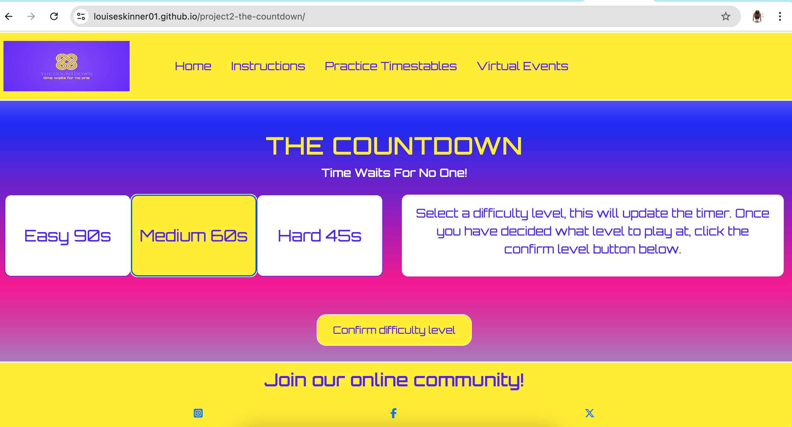 |
| Countdown Timer | A digital style timer, offering a clear and simple look, counts down during gameplay. This adds urgency and excitement, encouraging focus and simulating the real Countdown game.| 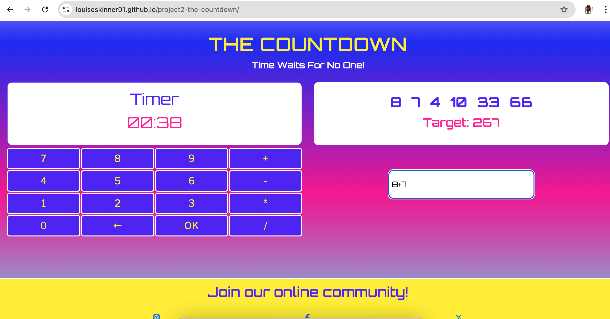 |
| Submit Answer | This is enabled by the user clicking the OK button on the built-in keyboard. It allows users to submit their calculation to see if they've successfully answered the current equation. Users can also use the `[ENTER]` key on their keyboard to submit their answers, too. | 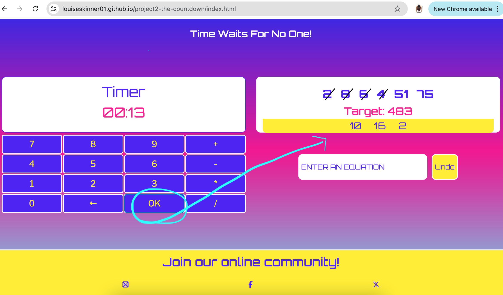 |
| Random Number Generation | Six numbers are generated at random (four small, two large). This ensures variety, so each game feels unique and unpredictable. |  |
| Target Number | A random target number is generated using only the numbers from the "6 random numbers generated in the previous step, and mathemateical operators to ensure the target number is realistic and achievable for players to reach. This provides a clear goal and challenge for each play. | 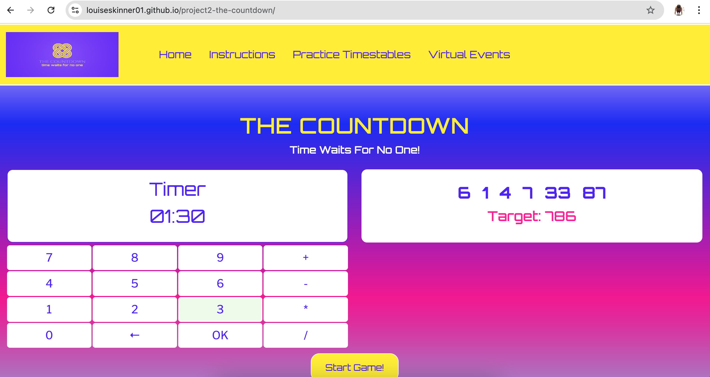 |
| Built-in Keypad | An interactive, customised keypad to provide a simplistic and clean gameplay. This ensures accessibility on both desktop and mobile, while preventing invalid inputs.| 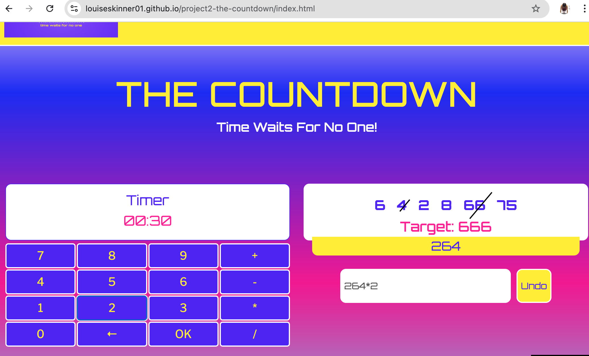 |
| Equation Validation & Feedback | Equations are checked instantly. Correct inputs show results, while incorrect ones display error messages. This helps users learn and avoid repeated mistakes. | 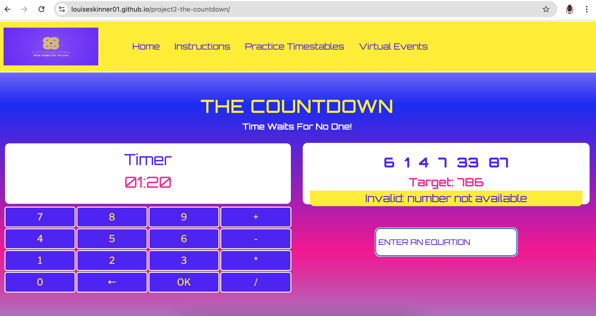 |
| Undo Feature | Players can undo their last equation. This allows experimentation without penalty, making the game more forgiving and user-friendly. | **Before Undo**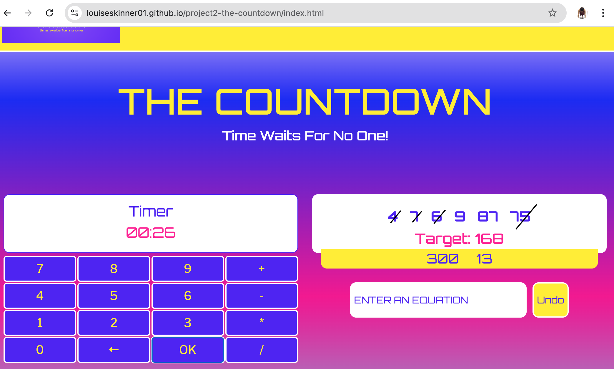 **After Undo**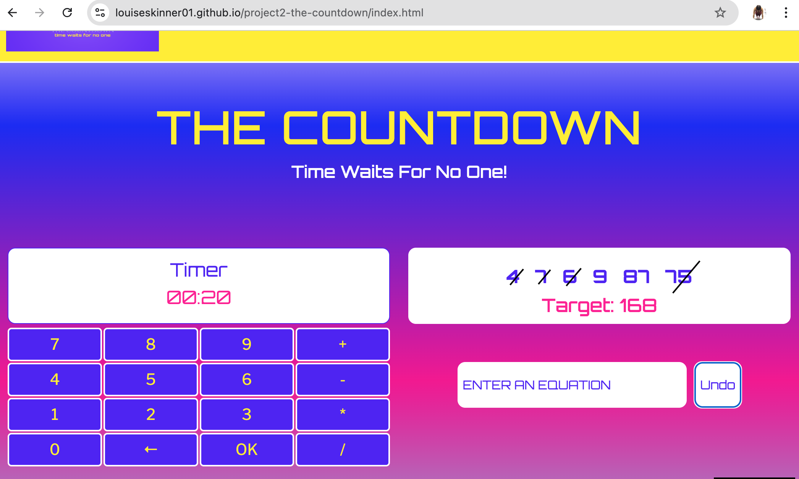 |
| Results Console | A console displays all previous equations and results. This lets users track their thinking process and reflect on strategies. | 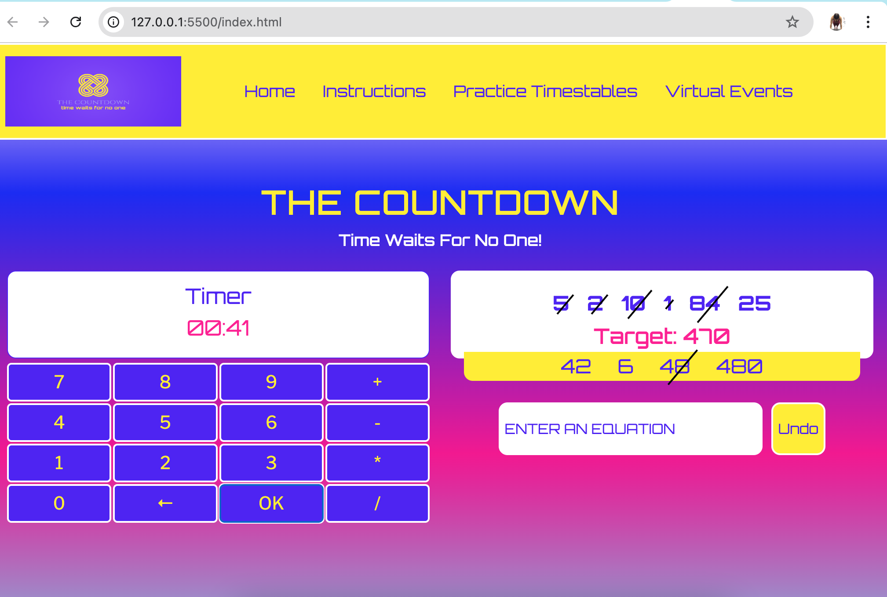 |
| Win & Lose Messages | At the end of each game, the player sees a clear outcome: either a celebratory win screen or an encouraging message if unsuccessful. | **Win message**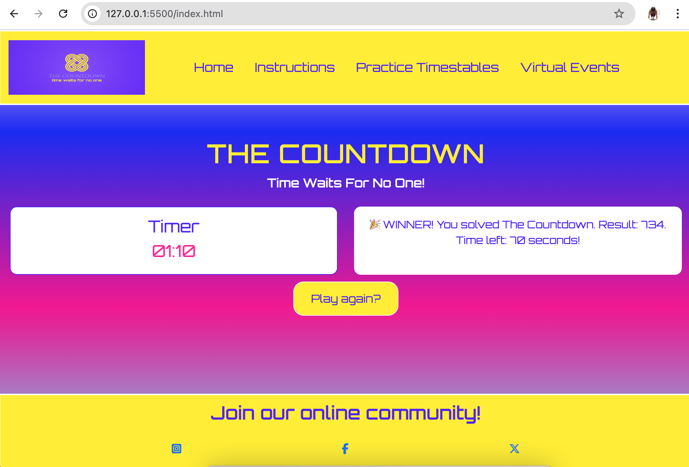 **Lose message**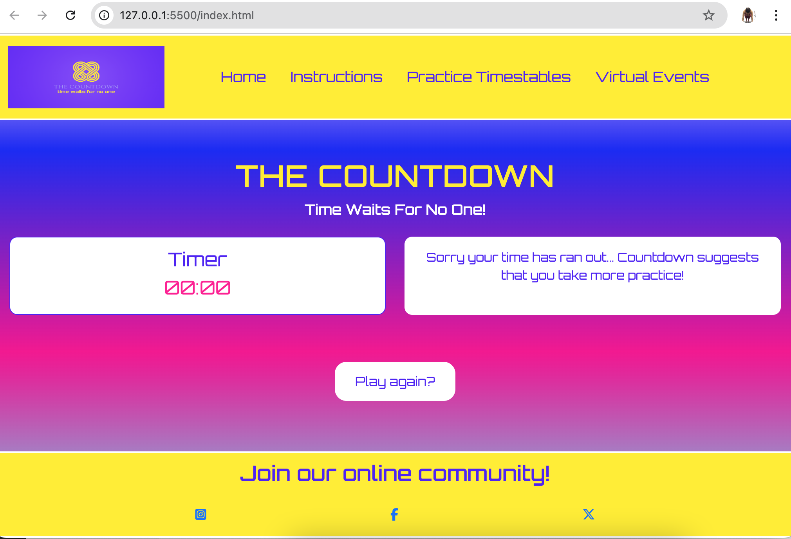 |
| Play Again Button | After each round, players can restart quickly without reloading the page. This boosts replayability and keeps users engaged. | 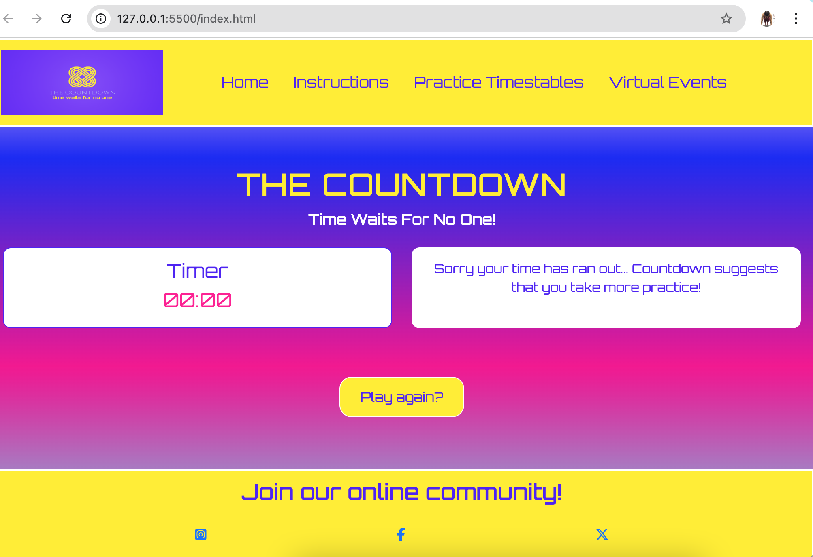 |
| Used Numbers| When a user uses a number by performing a calculation with it, the number then becomes out of use. This is shown by a black strike (text-decoration) through the used number, reminding the user that the number is no longer in use| 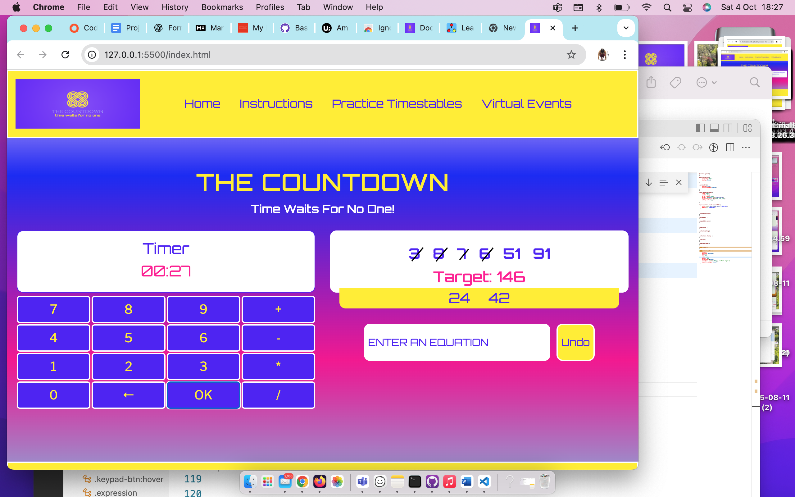 |
| Orientation Lock (Small Screen) | If the screen width is small, a warning appears telling the user to increase the size of their screen. This ensures the best layout and usability for small screens. | 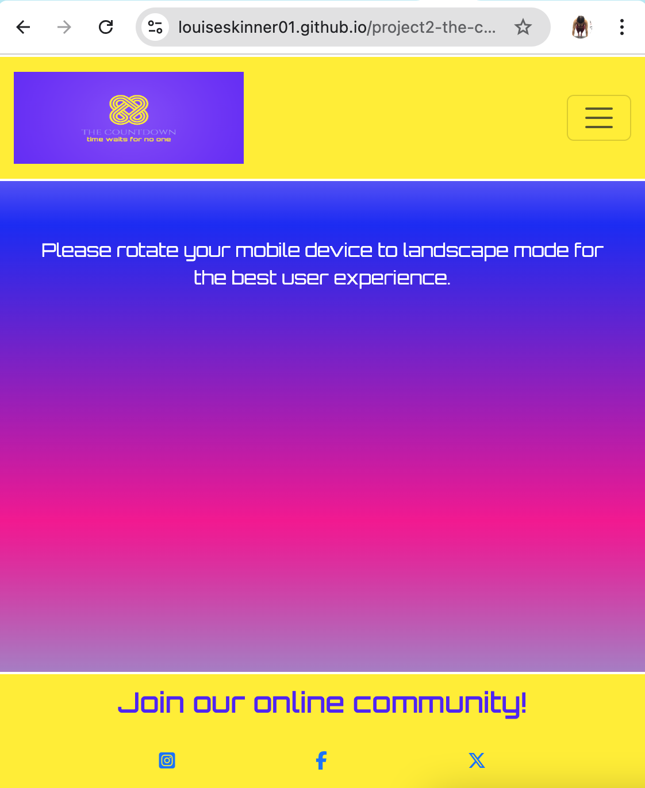 |
| User Registration Form | A simple registration form allows users to submit their details (e.g. name, email). This feature helps capture user interest, creates a sense of personal engagement, and could support future personalization or score-tracking. | 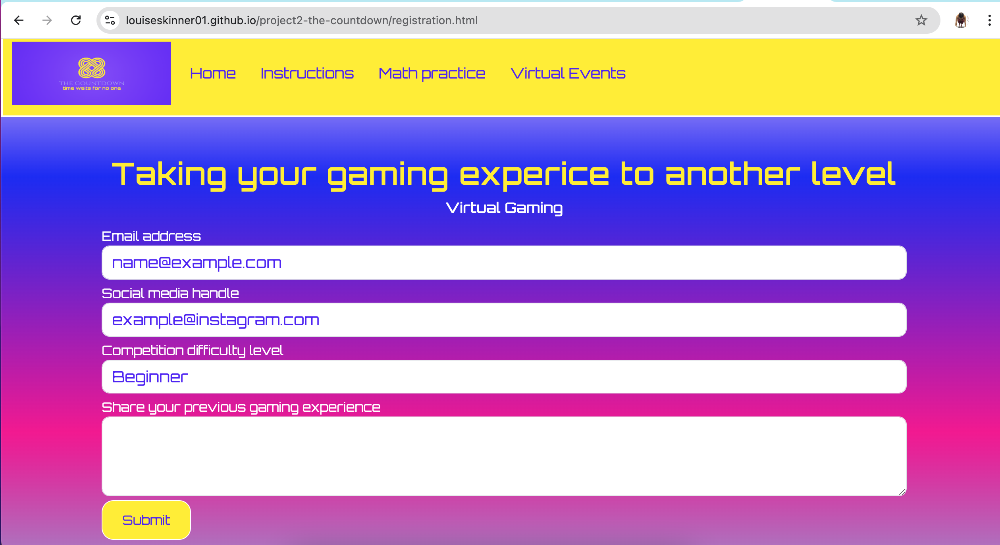  |
| 404 Error Message | The 404 error page will indicate when a user has somehow navigated to a page that doesn't exist. This replaces the default GitHub Pages 404 page, and ties-in with the look and feel of the *Love Maths* site by using the standard navbar and footer. | 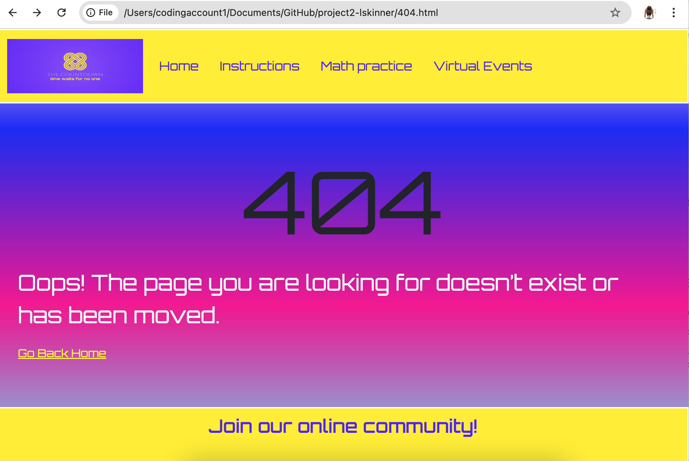 |

### Future Features

- **Advanced Calculations**: Add support for more complex mathematical operations, like square roots, powers, logarithms, trigonometry (sin, cos, tan), etc.
- **Equation History**: Display a running log of previous calculations with the ability to recall or reuse past results.
- **Multi-Step Equations**: Allow users to input multi-step calculations (e.g., `5 + 3 * 2 - 4`) with proper order of operations.
- **Fraction Support**: Add functionality to handle calculations with fractions, including simplifications and conversions between fractions and decimals.
- **Unit Conversions**: Introduce a feature to convert between different units of measurement (e.g., meters to feet, Celsius to Fahrenheit).
- **Equation Solver**: Add the ability to solve algebraic equations for a given variable (e.g., `2x + 5 = 13`).
- **Memory Functions**: Include memory functions (`M+`, `M-`, `MR`) so users can store, add to, and recall values during their calculations.
- **Input Validation**: Provide real-time feedback for invalid inputs, such as attempting to divide by zero or using incorrect syntax.
- **Dark Mode**: Add a dark mode option to enhance user experience and reduce eye strain during extended use.
- **Customisable Themes**: Allow users to choose different themes, colours, or layouts for personalizing their experience.
- **Calculation Explanations**: Display step-by-step explanations of how the solution is derived, useful for educational purposes or beginners.
- **Statistical Functions**: Introduce basic statistical operations such as mean, median, mode, and standard deviation.
- **Save & Share Calculations**: Allow users to save or share their results via a link or social media, especially for complex equations or useful outputs.
- **Voice Input**: Add a voice input option for users to dictate their calculations instead of typing.
- **Educational Quizzes**: Implement math-based quizzes or games to help users improve their arithmetic skills while using the app.
- **Scoreboard / Leaderboard**: Implement a scoring system that tracks correct answers, speed, and streaks. Users can compare scores on a leaderboard, adding gamification elements. This motivates users to improve performance, encouraging repeated engagement and friendly competition.
- **User Account / Login System**: Users can register, log in, and save their progress. Personalised accounts allow for tracking historical performance, customising difficulty settings, and storing achievements. This adds a long-term engagement factor and supports consistent learning.
- **Hints & Step-by-Step Solutions**:Provide optional hints or step-by-step solutions for complex problems. This helps users learn from mistakes, understand the process, and build confidence while practicing. This could be a feature that can be toggled on/off in the user account or game settings.
- **Custom Difficulty Levels**:Allow users to adjust difficulty beyond presets, such as limiting the numbers, operations, or time allowed. This gives users control over their challenge and ensures the game remains appropriate for different skill levels.
- **Progress Analytics / Stats Dashboard**:Track metrics such as accuracy, average completion time, and progress over time. Users can visually monitor improvement and identify areas for further practice, promoting data-driven learning.

## Tools & Technologies

| Tool / Tech | Use |
| --- | --- |
|  | Generate README and TESTING templates. |
|  | Version control. (`git add`, `git commit`, `git push`) |
|  | Secure online code storage. |
|  | Local IDE for development. |
|  | Main site content and layout. |
|  | Design and layout. |
|  | User interaction on the site. |
|  | Hosting the deployed front-end site. |
|  | Front-end CSS framework for modern responsiveness and pre-built components. |
|  | Automated JavaScript testing. |
|  | Creating wireframes. |
|  | Icons. |
|  | Help debug, troubleshoot, and explain things. |
|  | Tutorials/Reference Guide |

## Agile Development Process

### GitHub Projects

[GitHub Projects](https://www.github.com/Louiseskinner01/project2-the-countdown/projects) served as an Agile tool for this project. Through it, EPICs, User Stories, issues/bugs, and Milestone tasks were planned, then subsequently tracked on a regular basis using the Kanban project board.

| Stage   | Screenshot |
| ----- | --- |
| To Do | 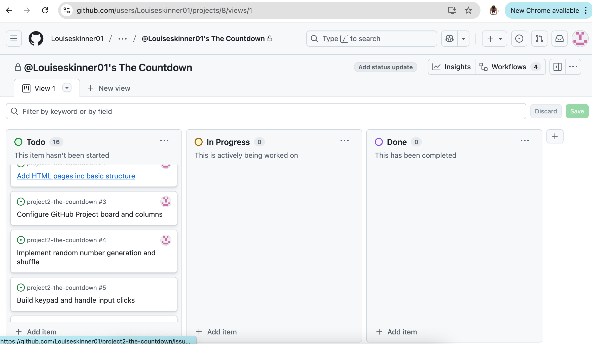 |
| In-progress | 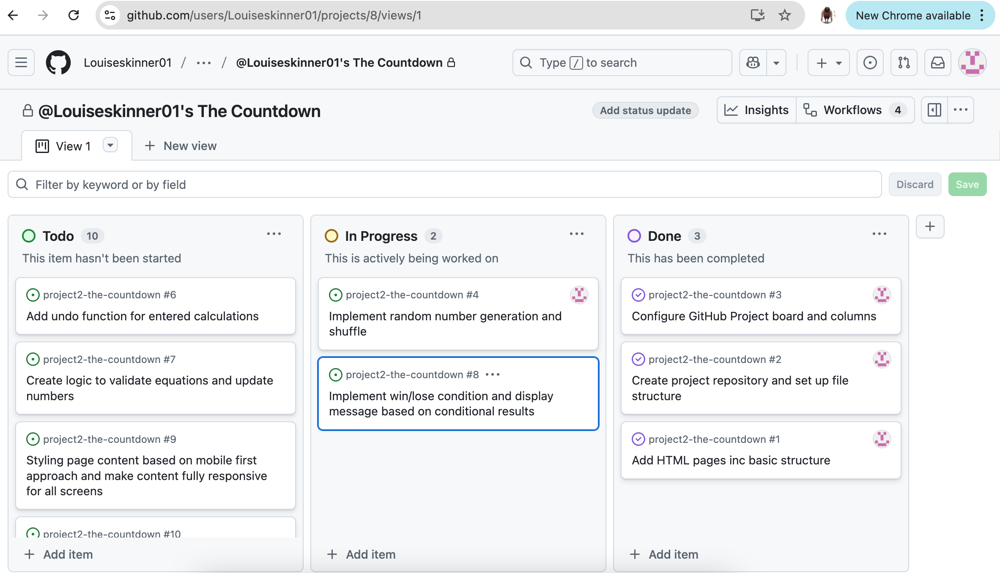 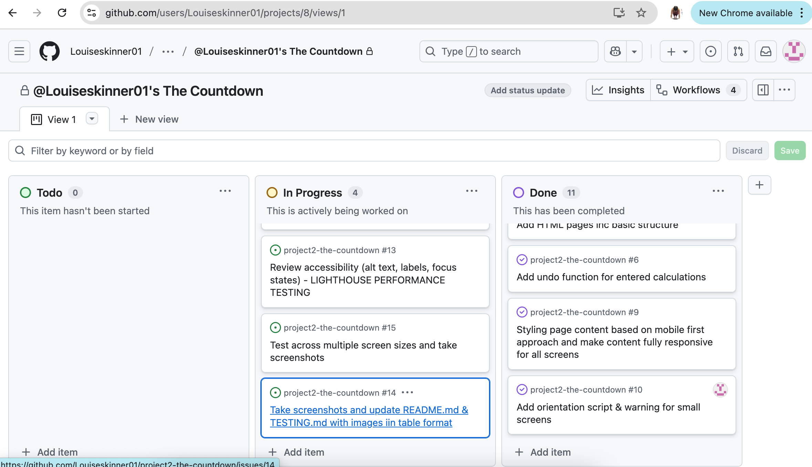 |
| Done | 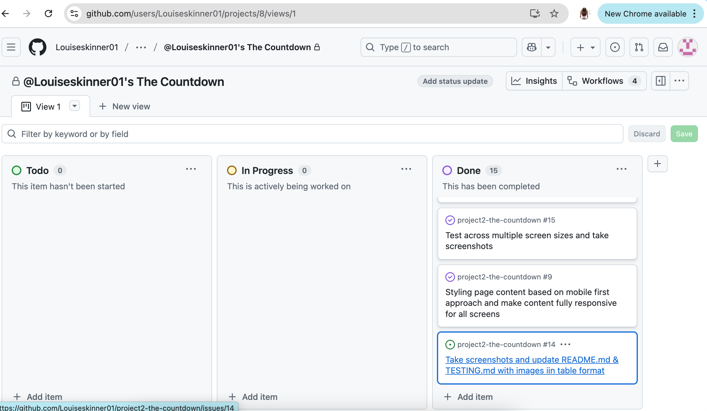 |

### GitHub Issues

[GitHub Issues](https://www.github.com/Louiseskinner01/project2-the-countdown/issues) served as an another Agile tool. There, I managed my User Stories and Milestone tasks, and tracked any issues/bugs.

| Link | Screenshot |
| --- | --- |
|  | 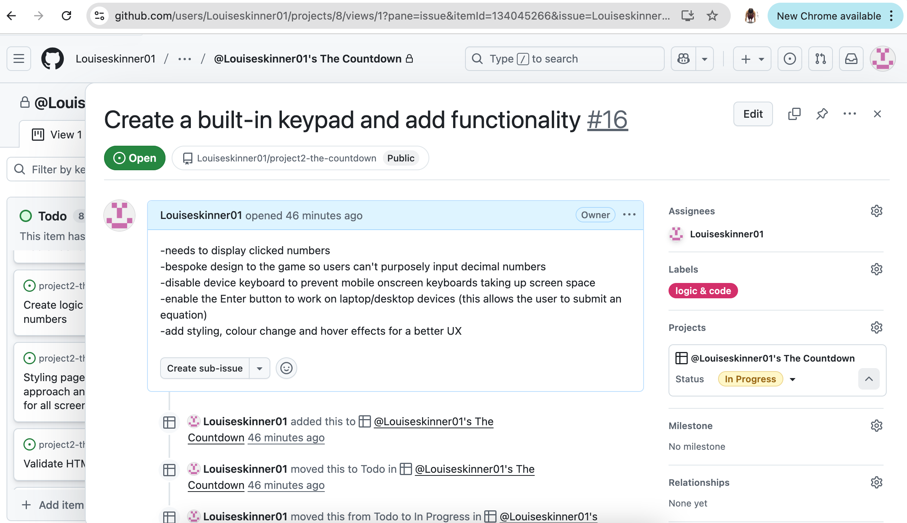 |
|  | 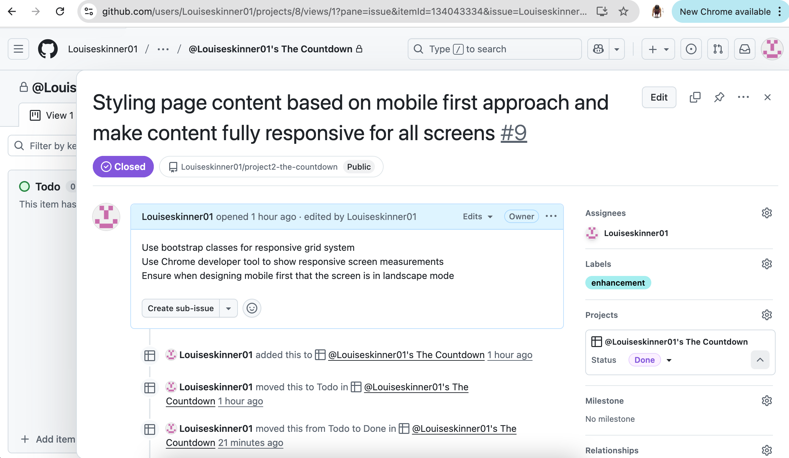 |

### MoSCoW Prioritization

I've decomposed my Epics into User Stories for prioritizing and implementing them. Using this approach, I was able to apply "MoSCoW" prioritization and labels to my User Stories within the Issues tab.

- **Must Have**: guaranteed to be delivered - required to Pass the project (*max ~60% of stories*)

  - Must Have (Core to the project – without these the game doesn’t work)
  - As a player, I want to choose a difficulty level, so that I can play at my preferred challenge and time limit.
  - As a player, I want to see a countdown timer, so that I know how much time I have left to solve the problem.
  - As a player, I want to generate a random set of numbers, so that every game feels different and fresh.
  - As a player, I want to be given a target number, so that I know what I’m aiming for in my calculations.
  - As a player, I want to input equations using a keypad, so that I can interact easily on mobile and desktop.
  - As a player, I want the game to validate my equations, so that I don’t waste time with invalid inputs.
  - As a player, I want instant feedback when I reach the target, so that I know I’ve won.
  - As a player, I want to see a "Play Again" option after finishing a game, so that I can quickly start a new round.

Advanced operations (like square roots, exponents, or brackets).
- **Should Have**: adds significant value, but not vital (*~20% of stories*)

  - As a player, I want to undo a calculation step, so that I can correct mistakes without restarting the whole game.
  - As a mobile user, I want large, tap-friendly buttons, so that I can play easily on my phone.
  - As a visually impaired user, I want clear colour contrasts (e.g. bold backgrounds and bright highlights), so that I can see buttons and numbers more clearly.
  - As a user with little math knowledge, I want helpful error messages, so that I understand what I did wrong.

- **Could Have**: has small impact if left out (*the rest ~20% of stories*)

  - As a player, I want to start the game only when my device is in landscape mode, so that I can play with a clear and consistent layout.
  - As a casual user, I want to play for fun and relaxation, so that I can enjoy the game without pressure.
  - As a competitive user, I want to solve the problem within the timer, so that I feel challenged.
  - As a learner, I want to practice equations in a playful way, so that I can improve my math skills without it feeling like work.

- **Won't Have**: not a priority for this iteration - future features

  - Multiplayer mode or online leaderboards.
  - Saving player stats across sessions.
  - Custom number sets chosen by the player.

## Testing

> [!NOTE]  
> For all testing, please refer to the [TESTING.md](TESTING.md) file.

## Deployment

### GitHub Pages

The site was deployed to GitHub Pages. The steps to deploy are as follows:

- In the [GitHub repository](https://www.github.com/Louiseskinner01/project2-the-countdown), navigate to the "Settings" tab.
- In Settings, click on the "Pages" link from the menu on the left.
- From the "Build and deployment" section, click the drop-down called "Branch", and select the main branch, then click "Save".
- The page will be automatically refreshed with a detailed message display to indicate the successful deployment.
- Allow up to 5 minutes for the site to fully deploy.

The live link can be found on [GitHub Pages](https://louiseskinner01.github.io/project2-the-countdown).

### Local Development

This project can be cloned or forked in order to make a local copy on your own system.

#### Cloning

You can clone the repository by following these steps:

1. Go to the [GitHub repository](https://www.github.com/Louiseskinner01/project2-the-countdown).
2. Locate and click on the green "Code" button at the very top, above the commits and files.
3. Select whether you prefer to clone using "HTTPS", "SSH", or "GitHub CLI", and click the "copy" button to copy the URL to your clipboard.
4. Open "Git Bash" or "Terminal".
5. Change the current working directory to the location where you want the cloned directory.
6. In your IDE Terminal, type the following command to clone the repository:
	- `git clone https://www.github.com/Louiseskinner01/project2-the-countdown.git`
7. Press "Enter" to create your local clone.

Alternatively, if using Gitpod, you can click below to create your own workspace using this repository.

**Please Note**: in order to directly open the project in Gitpod, you should have the browser extension installed. A tutorial on how to do that can be found [here](https://www.gitpod.io/docs/configure/user-settings/browser-extension).

#### Forking

By forking the GitHub Repository, you make a copy of the original repository on our GitHub account to view and/or make changes without affecting the original owner's repository. You can fork this repository by using the following steps:

1. Log in to GitHub and locate the [GitHub Repository](https://www.github.com/Louiseskinner01/project2-the-countdown).
2. At the top of the Repository, just below the "Settings" button on the menu, locate and click the "Fork" Button.
3. Once clicked, you should now have a copy of the original repository in your own GitHub account!

### Local VS Deployment

There are no remaining major differences between the local version when compared to the deployed version online.

## Credits
### Content

| Source | Notes |
| --- | --- |
| [Markdown Builder](https://markdown.2bn.dev) | Help generating Markdown files |
| [Interactive Frontend Development](https://codeinstitute.net) | Code Institute walkthrough project inspiration |
| [w3schools](https://www.w3schools.com/) | Help with form validation, display:block/none vs visibiliy: visible/hidden |
| [JavaScript In Easy Steps](https://ineasysteps.com/wp-content/uploads/2020/02/JavaScript-in-easy-steps-6th-edition-9781840788778-TOCCh1.pdf) | Additional JS help |
| [Bootstrap](https://getbootstrap.com) | Various components / responsive front-end framework |
| [ChatGPT](https://chatgpt.com) | Help with code logic and explanations: **Example 1** Initially, when I tried to copy an array, changes to the “copy” also changed the original — because they both referenced the same array in memory. I fixed this by creating a true copy using the _spread operator_:      `const originalArray = [1, 2, 3];`  `const copiedArray = [...originalArray];` **Example 2** The undo function lets the user reverse their last action. I used chat to help me understand the logic and then to implement a function that saves the game state in an array before each change so when the user clicks “Undo”, the last saved state is restored, bringing everything back to how it was. This function is called `function undoEquation(result, usedNumbersJSON, input)` and can be found in the _workingout-grid.js_ file. **Example 3** I was having some UX issues with onscreen keypads (mobile device) during game play so I had create a built-in keypad but needed some help with functionality. Clicking a button either deletes the last character (←), submits the input (OK), or adds a number/operator to the input. It keeps the input focused so the user can continue typing smoothly. This makes the keypad intuitive and responsive, like a real calculator. The code from Chat is inserted into the `function createKeypad()` and can be found in the _workingout-grid.js_ file.

 

### Media
- Image Compression
    - [TinyPNG](https://tinypng.com) (for images <5MB)
    - [CompressPNG](https://compresspng.com) (for images >5MB)
- Logo Make
  - [Looka](https://looka.com/explore)

| Source | Notes |
| --- | --- |
| [favicon.io](https://favicon.io) | Generating the favicon |
| [Font Awesome](https://fontawesome.com) | Icons used throughout the site |
| [TinyPNG](https://tinypng.com) | Compressing images < 5MB |
| [CompressPNG](https://compresspng.com) | Compressing images > 5MB |
| [GoogleFonts](https://fonts.google.com/) | Font styles throughout the site |

### Acknowledgements

- I would like to thank my Code Institute mentor, [Tim Nelson](https://www.github.com/TravelTimN) for the support throughout the development of this project.
- I would like to thank the [Code Institute](https://codeinstitute.net) Tutor Team for their assistance with troubleshooting and debugging some project issues.
- I would like to thank the [Code Institute Slack community](https://code-institute-room.slack.com) for the moral support; it kept me going during periods of self doubt and impostor syndrome.
- I would like to thank my little boy for giving me the drive and motivation to develop the right skills so I can be a successful web developer. 

