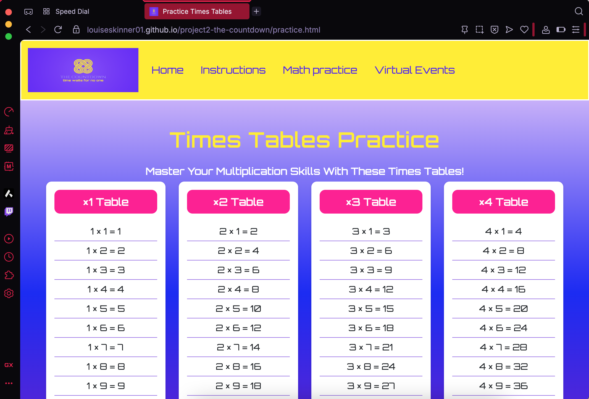
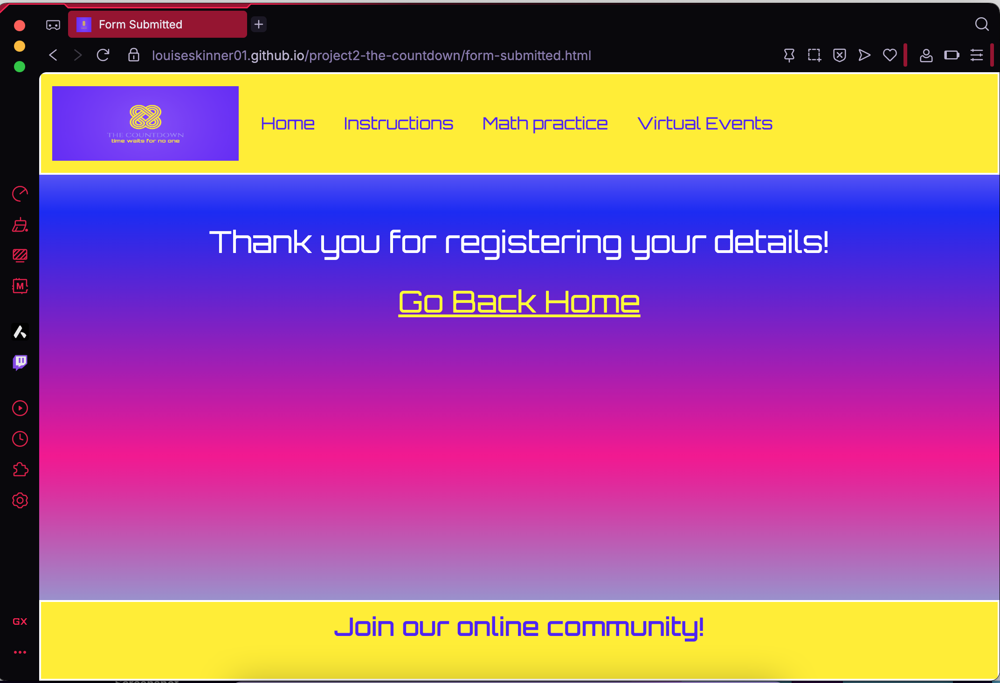

# Testing

> [!NOTE]  
> Return back to the [README.md](README.md) file.

## Rationale
The primary goal of testing was to ensure the Countdown Game application performs consistently across multiple devices and screen sizes, maintaining both functionality and a good user experience.

## Approach
Testing was carried out to ensure that the website functions as intended, is responsive across different devices, and provides a smooth and intuitive user experience.
All tests were conducted manually, using a combination of Google Chrome DevTools, HTML/CSS/JS validation tools, and live user interaction testing.

## Methods

| Method                    | Description                                                                                                                                                                        | Tools Used                                                                                                                                |
| ------------------------- | ---------------------------------------------------------------------------------------------------------------------------------------------------------------------------------- | ----------------------------------------------------------------------------------------------------------------------------------------- |
| **Manual Testing**        | Each feature and button was manually tested to verify correct functionality. This included checking form submissions, button click responses, game flow, and orientation behavior. | Browser console, on-screen interaction                                                                                                    |
| **Responsive Testing**    | Tested using Chrome DevTools’ built-in device emulation. Ensured the layout adapts correctly to different screen widths and orientations.                                          | Chrome DevTools                                                                                                                           |
| **Cross-Browser Compatibility Testing** | Tested in multiple browsers to ensure consistent design, color rendering, and interactivity.                                                                                       | Chrome, Firefox, Safari, Edge                                                                                                     |
| **Validation Testing**    | Used validation tools to check that the HTML, CSS, and JavaScript are free from syntax errors and follow best practices.                                                           | [W3C HTML Validator](https://validator.w3.org/), [W3C CSS Validator](https://jigsaw.w3.org/css-validator/), [JSHint](https://jshint.com/) |
| **Accessibility Testing** | Checked color contrast, font readability, tab navigation, and proper use of ARIA and semantic tags where applicable.                                                               | Chrome Lighthouse, manual checks                                                                                                          |
| **Performance Testing**   | Evaluated page load speed and responsiveness using Chrome Lighthouse.                                                                                                              | Chrome DevTools  Lighthouse                                                                                                              |

### Manual Tests (Defensive Programming)

| Feature Tested | Test Description                                   | Expected Outcome                                | Pass/Fail             |  Screenshot |
| ------------------- | ------------------------------------------------ | ----------------------------------------------- | ------------------- | ----------- |
| Start Game Button   | Clicked “PLAY?” and then “Start Game”            | Game begins, keypad becomes active              | ✅ Works |  |
| Orientation Warning | Rotated mobile device from portrait to landscape | Warning disappears and game becomes visible     | ✅ Works |  |
| Difficulty Buttons  | Selected “Easy / Medium / Hard”                  | Correct timer and equation difficulty displayed | ✅ Works |  |
| Keypad Input        | Clicked number keys and OK                       | Values entered correctly into equation input    | ✅ Works |  |
| Timer Countdown     | Started game at different difficulties           | Timer matched selected duration                 | ✅ Works |  |
| Play Aagin? Button     |  Clicked the button at the end of a game     | Resets the window bringing the user back to the clickable PLAY? text                  | ✅ Works |  |
Confirm difficulty |  Clicked the confirm button on diffeent difficulty levels | Locks difficulty, updates the timer and removes buttons from further use  | ✅ Works          |  |
| Generate numbers   | Six random numbers displayed           | Unique each round               | ✅  Works         |  |
Get target number  | Generates valid target (122–1017)      | Within range                    | ✅ Works          |  |
Keypad input       | Inputs digits and operators            | Responsive and accurate         | ✅  Works         |  |
Undo button        | Clicked the undo button after submitting an equation | Clears last entry and restores numbers              | ✅  Works         |  |
Win condition      | Displays winner message                | Works and stops timer           | ✅  Works         |  |
Lose condition     | Displays timeout message               | Works and triggers “Play Again” | ✅ Works          |  |

| Element Tested                | Test Description                   | Expected Outcome                        | Pass/Fail |
| -------------------------- | ---------------------------------- | ----------------------------- | --------- |
| Console area               | Displays messages clearly          | Text visible and styled       | ✅ Pass          |
| Buttons                    | Hover and click effects consistent | Colors and transitions smooth | ✅ Pass           |
| Orientation warning        | Displays on portrait mobile        | Hides automatically on rotate | ✅  Pass          |
| Placeholder text           | Color visible and readable         | Matches theme                 | ✅  Pass          |
| Font and color consistency | Uses variables correctly           | All consistent                | ✅  Pass        |

| User Story Tested | Test Description | Expected Outcome | Pass/Fail |
| --- | --- | --- | --- |
| “As a user, I want to choose my own difficulty level” | Visit the home page and click the PLAY? text on the screen, follow the instructions that lead to the select a difficulty level. Select a level by clicking on the button and then clicking the confirm difficulty button.  | The timer is updated to reflect the difficulty level that has been selected | ✅ Pass |
| “As a user, I want to clearly see the timer and generated numbers” | Follow the game instructions untill the timer and random numbers are displayed. | Numbers displayed in console are clearly formatted and the timer digits displayed to the left of the console are large and standout. | ✅ Pass |
| “As a user, I want to input equations easily” | Follow the instructions, once a target number has been generated the built-n keypad will appear. Click on the keyoad buttons and wsee the numbers/operators appear in the input box. | Keypad input is smooth, responsive and has the displays the correct output into the corret area. 2| ✅ Pass |
| “As a user, I want feedback on results” | Once the game is in play (after the start game button has been clicked) the user can enter equations via the keypad. If an equation is successful the result will appear at the bottom of the console else the console will display an error message. | Console updates with results, striked out used numbers and messages (error, win/lose). | ✅ Pass |
| “As a user, I want to play again quickly” | Click on the play again button which displays the home page so a difficulty level can be selected for a new game. | The window is reloaded, clearing all existing DOM elements and displays the PLAY? text| ✅ Pass |
| “As a user, I want to be prevented from entering invalid equations” | Use the keypad to enter invalid equations | The console displays an error message, the user is able to continue the game without it crashing. | ✅ Pass |
| “As a user, I want the orientation message to guide me on mobile” | Visit the deployed site using a mobile device. Visit each page on the website and rotate the device between landscape and portrait. | Warning shows in portrait, disappears in landscape. | ✅ Pass |
| “As a user, I want used numbers to be tracked correctly” | Use the keypad to enter values (numbers from generated numbers or results) into the input box. | Once a number is used, it becomes unavailabl and it’s strucken out with a black strike. | ✅ Pass |
| “As a user, I want the game to reset properly when I play again” | At the end of a game, click the play again buttin. | The user is presented with the home page PLAY? text. | ✅ Pass |
| “As a user, I want to be challenged in a realistic way” | Perform manual calculations on the target number and the random numbers produced to ensure the target number is always achievable. | Target numbers can always be solved by using some or all of the 6 randomly generated numbers. | ✅ Pass |

### Responsiveness
Google Chrome DevTools was used extensively to simulate various device viewports, including popular smartphones, tablets, and desktop resolutions. This allowed for a controlled testing environment to verify that the layout, interactive elements, and overall responsiveness behaved as intended under different conditions.

Particular attention was given to:

Responsive design: Ensuring all elements (buttons, grids, and text) resize and reposition correctly.

Touch interactions: Confirming buttons and inputs respond properly on smaller screens.

Orientation changes: Validating that the landscape and portrait orientation logic functions correctly on mobile devices.

Visual consistency: Checking that colours, fonts, and spacing remain aligned with the intended design across all viewports.

By testing through Chrome DevTools, I was able to efficiently identify and resolve layout shifts, overlapping elements, and scaling issues before deployment. This ensured the final build delivered a clean, accessible, and user-friendly experience on all supported devices.

I've tested my deployed project to check for responsiveness issues.

| Page | Mobile (Portrait) | Mobile (Lanscape)| Tablet | Laptop | Desktop | Notes |
| --- | --- | --- | --- | ---| --- |--- |
| Home (landing page) |  |  |  |  |  | |
| Home (during Play) | NA |  |  |  |  |  | 
| Instructions |  |  |  |  |  | |
| Practice |  |  |  |   |  |
| registration |  |    |  |  |  | |
| form-submitted |  |  |  |   |  | | 
| 404 |  |  |  |   |  | |

| Device                  | Screen Size (Approx.) | Orientation Tested   | Result                                                              |
| ----------------------- | --------------------- | -------------------- | ------------------------------------------------------------------- |
| iPhone SE               | 375 × 667 px          | Portrait / Landscape | ✅ Fully functional and responsive                                   |
| iPhone 12 Pro           | 390 × 844 px          | Portrait / Landscape | ✅ Layout scales correctly, all buttons accessible                   |
| iPhone 14 Pro Max       | 430 × 932 px          | Portrait / Landscape | ✅ Smooth transition between orientations                            |
| Pixel 7                 | 412 × 915 px          | Portrait / Landscape | ✅ Responsive elements adjust correctly                              |
| Samsung Galaxy S8+      | 360 × 740 px          | Portrait / Landscape | ✅ No layout distortion observed                                     |
| iPad Air                | 820 × 1180 px         | Portrait / Landscape | ✅ Layout adjusts well; game content centered                        |
| iPad Mini               | 768 × 1024 px         | Portrait / Landscape | ✅ Fully functional; text and button scaling appropriate             |
| Surface Pro 7           | 912 × 1368 px         | Landscape            | ✅ Desktop-style layout renders correctly                            |
| Desktop (1080p)         | 1920 × 1080 px        | Landscape            | ✅ All components display as intended with balanced spacing          |
| Large Display (2560px+) | Variable              | Landscape            | ✅ Tested using media query breakpoint; scaling remains proportional |

## Testing Summaries 

### Cross-Browser Compatitbility

To ensure a consistent and accessible user experience across all devices and browsers, the project was thoroughly tested using Google Chrome DevTools. This allowed emulation of multiple devices (iPhone, Samsung Galaxy, iPad, Surface Duo, etc.) and responsive breakpoints to verify that all layout, interaction, and orientation features behaved correctly.

Cross-browser compatibility testing was performed manually in the following browsers:
 - Chrome
 - Firefox
 - Safari 
 - Edge
 - Opera

 Each browser was checked for layout consistency, JavaScript functionality (such as keypad interactivity and timers), and color rendering.

The goal was to confirm that the web app provides the same smooth gameplay and responsive UI on both desktop and mobile environments, regardless of platform or browser engine.

I've tested my deployed project on multiple browsers to check for compatibility issues.

| Page | Chrome | Firefox | Safari | Edge | Opera | Notes
| --- | --- | --- | --- | --- | --- | --- |
| Index.html (Home - Rotate Warning)  |  |  |  |  |  | Works as expected |
| Index.html (Home - PLAY?)  |  |  |  |   |  | Works as expected |
| Index.html (Home - During Play)  |  |  |  |  |  | Works as expected |
| Instructions.html |  |  |  |   |  | Works as expected |
| Practice.html |  |  |  |  |  | Works as expected |
| Registration.html |  |  |  |   |  | Works as expected |
| Form-submitted.html |  |  |  |   |  | Works as expected |
| 404.html |  |  |  |  |  | Works as expected |

### Validation summary

#### HTML

I have used the recommended [HTML W3C Validator](https://validator.w3.org) to validate all of my HTML files.

| Directory | File | URL | Screenshot | Notes |
| --- | --- | --- | --- | --- |
|  | [404.html](https://github.com/Louiseskinner01/project1-lskinner/blob/main/404.html) | [HTML Validator](https://validator.w3.org/nu/?doc=https://louiseskinner01.github.io/project1-lskinner/404.html) |  | ⚠️ Notes (if applicable) |
|  | [bookings.html](https://github.com/Louiseskinner01/project1-lskinner/blob/main/bookings.html) | [HTML Validator](https://validator.w3.org/nu/?doc=https://louiseskinner01.github.io/project1-lskinner/bookings.html) |  | ⚠️ Notes (if applicable) |
|  | [confirmation.html](https://github.com/Louiseskinner01/project1-lskinner/blob/main/confirmation.html) | [HTML Validator](https://validator.w3.org/nu/?doc=https://louiseskinner01.github.io/project1-lskinner/confirmation.html) |  | ⚠️ Notes (if applicable) |
|  | [index.html](https://github.com/Louiseskinner01/project1-lskinner/blob/main/index.html) | [HTML Validator](https://validator.w3.org/nu/?doc=https://louiseskinner01.github.io/project1-lskinner/index.html) |  | ⚠️ Notes (if applicable) |
|  | [my-gym.html](https://github.com/Louiseskinner01/project1-lskinner/blob/main/my-gym.html) | [HTML Validator](https://validator.w3.org/nu/?doc=https://louiseskinner01.github.io/project1-lskinner/my-gym.html) |  | ⚠️ Notes (if applicable) |
|  | [nutrition.html](https://github.com/Louiseskinner01/project1-lskinner/blob/main/nutrition.html) | [HTML Validator](https://validator.w3.org/nu/?doc=https://louiseskinner01.github.io/project1-lskinner/nutrition.html) |  | ⚠️ Notes (if applicable) |

#### CSS
I have used the recommended [CSS Jigsaw Validator](https://jigsaw.w3.org/css-validator) to validate all of my CSS files.

| Directory | File | URL | Screenshot | Notes |
| --- | --- | --- | --- | --- |
| assets | [stylesheet.css](https://github.com/Louiseskinner01/project2-the-countdown/blob/main/assets/css/stylesheet.css) | [CSS Validator](https://jigsaw.w3.org/css-validator/validator?uri=https://github.com/Louiseskinner01/project2-the-countdown/blob/main/assets/css/stylesheet.css) |    |  |
|  | [workingout-grid.css](https://github.com/Louiseskinner01/project1-lskinner/blob/main/assets/css/new-stylesheet.css) | [CSS Validator](https://jigsaw.w3.org/css-validator/validator?uri=https://github.com/Louiseskinner01/project2-the-countdown/blob/main/assets/css/workingout-grid.css) |   |  |
|  | [other-styling.css](https://github.com/Louiseskinner01/project1-lskinner/blob/main/assets/css/new-stylesheet.css) | [CSS Validator](https://jigsaw.w3.org/css-validator/validator?uri=https://github.com/Louiseskinner01/project2-the-countdown/blob/main/assets/css/other-styling.css) |   |  |
|  | [global-variables.css](https://github.com/Louiseskinner01/project1-lskinner/blob/main/assets/css/new-stylesheet.css) | [CSS Validator](https://jigsaw.w3.org/css-validator/validator?uri=https://github.com/Louiseskinner01/project2-the-countdown/blob/main/assets/css/global-variables.css) |   |  |

#### JS
I have used the recommended [JSHint](https://jshint.com/) to validate all of my CSS files.

| Directory | File | URL | Screenshot | Notes |
| --- | --- | --- | --- | --- |
| assets | [script.js](https://github.com/Louiseskinner01/project2-the-countdown/blob/main/assets/js/script.js) | [JSHint valid code](https://jigsaw.w3.org/css-validator/validator?uri=https://github.com/Louiseskinner01/project2-the-countdown/blob/main/assets/js/script.js) | | I added `/* jshint esversion: 6 */` to the top of my js files and that reduced the warnings by a significant amount. |
|  | [workingout-grid.js](https://github.com/Louiseskinner01/project2-the-countdown/blob/main/assets/js/workingout-grid.js) | [JSHint valid code](https://jigsaw.w3.org/css-validator/validator?uri=) |   | ` /* jshint esversion: 11 */` `/* exported createEquationRow, createKeypad */` |

### Accessibility Summary 
 
| Test                                                             | Result |
| ---------------------------------------------------------------- | ------ |
| Color contrast meets WCAG 2.1 standards                          | ✅      |
| Text size and spacing adjustable                                 | ✅      |
| Interactive elements clearly labeled and accessible via keyboard | ✅      |
| ARIA labels provided for key game sections                       | ✅      |
| Orientation and responsiveness maintained for screen readers     | ✅      |

### Performance summary

## Bugs / Fixes

| Issue                                         | Cause                          | Solution                               | Status  |
| --------------------------------------------- | ------------------------------ | -------------------------------------- | ------- |
| Keypad not resizing correctly                 | Flexbox conflict               | Adjusted grid layout                   | ✅ Fixed |
| Timer not resetting on replay                 | Countdown interval not cleared | Added `clearInterval()`                | ✅ Fixed |
| “Play?” span reappeared on orientation change | Re-triggered event listener    | Added `.remove()` on click             | ✅ Fixed |
| Placeholder color not applying                | CSS selector conflict          | Used `::placeholder` with `!important` | ✅ Fixed |
| Buttons remaining visible when the screen size is reduced or mobile device in put into portrait          | Missing DOM elements in the orientation.js file       | Added `const controllerBtnsContainer = document.getElementById("controllers-area");` & `controllerBtnsContainer.classList.add("hidden");` in the IF condition, with `controllerBtnsContainer.classList.remove("hidden");` in the else condition| ✅ Fixed |
### Known/Existing Issues

| Issue | Screenshot |
| --- | --- |

| When validating HTML with a semantic `<section>` element, the validator warns about lacking a header `h2-h6`. This is acceptable. |  |

> [!IMPORTANT]  
> From my testing I have not identified any bugs other than the ones listed in the above sections. If you identify any new bugs please feel free to contact me and/or clone the project and fix the issue.