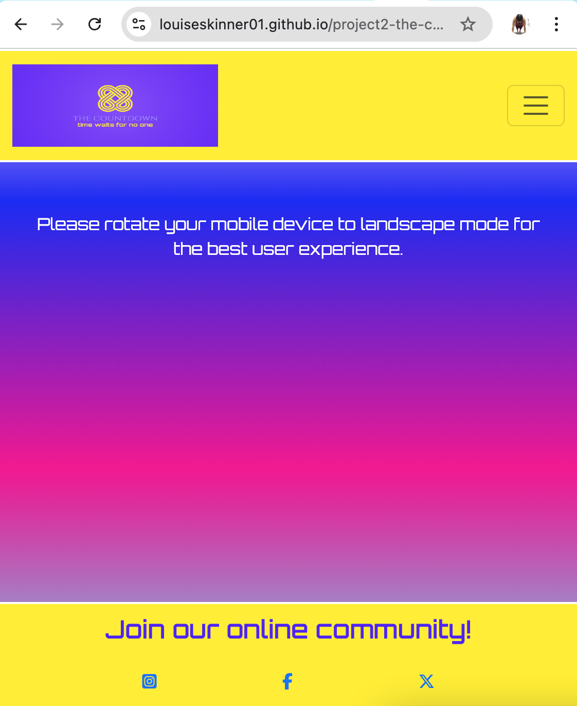
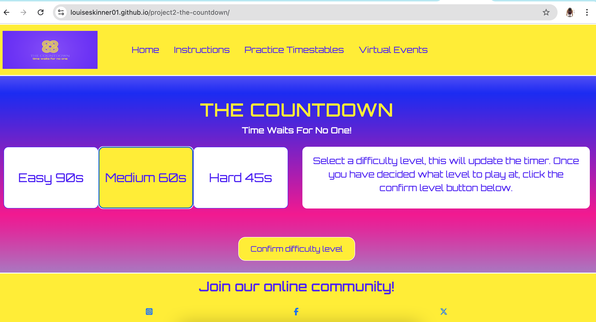
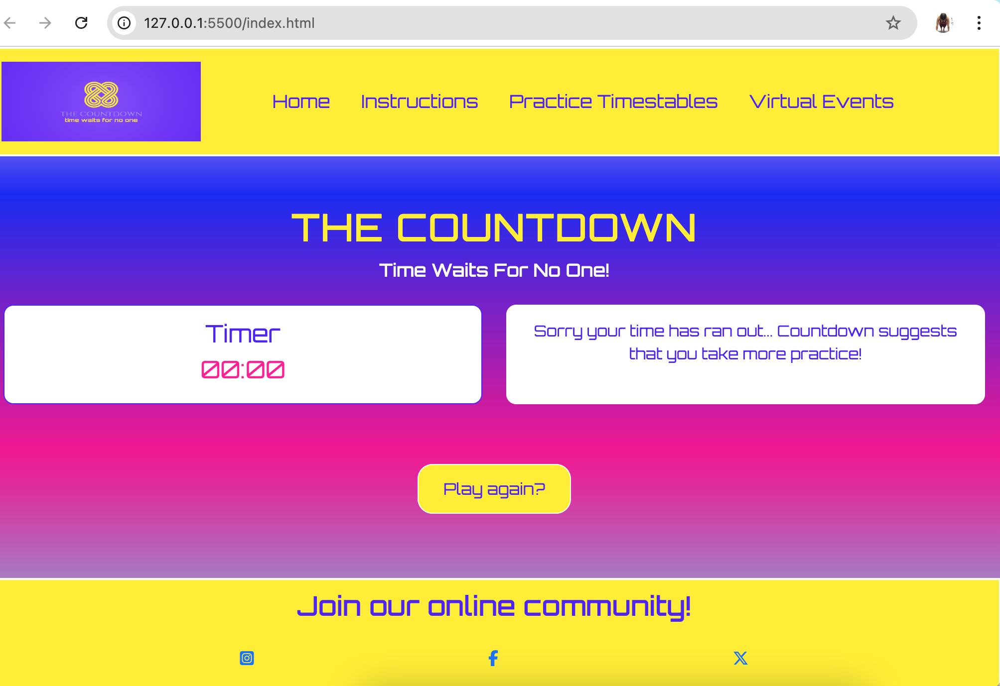
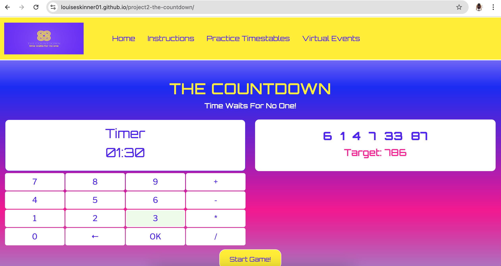
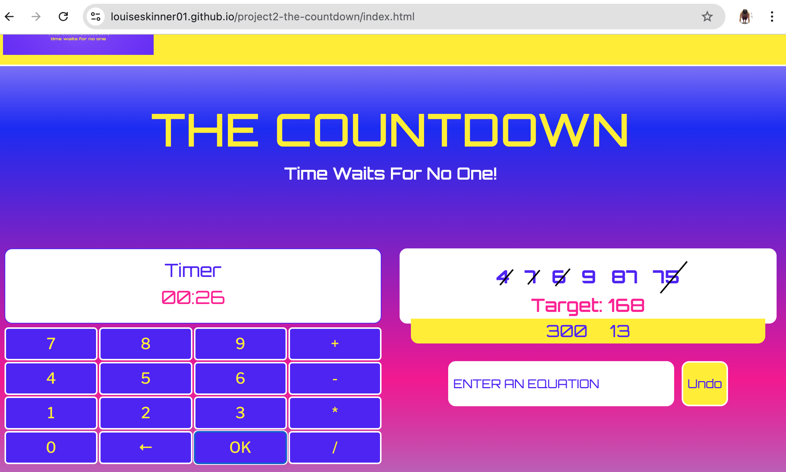
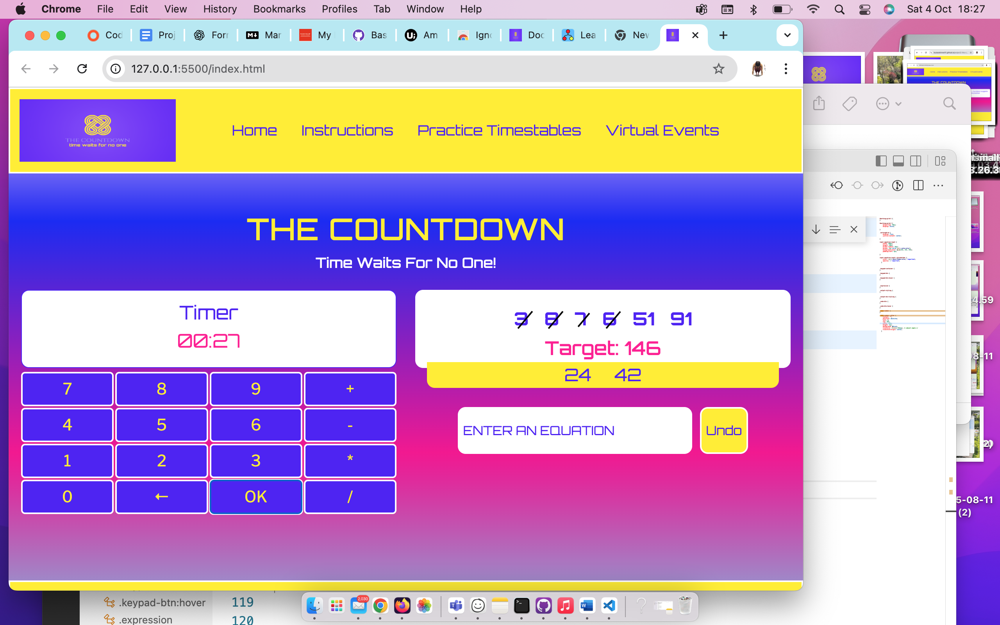
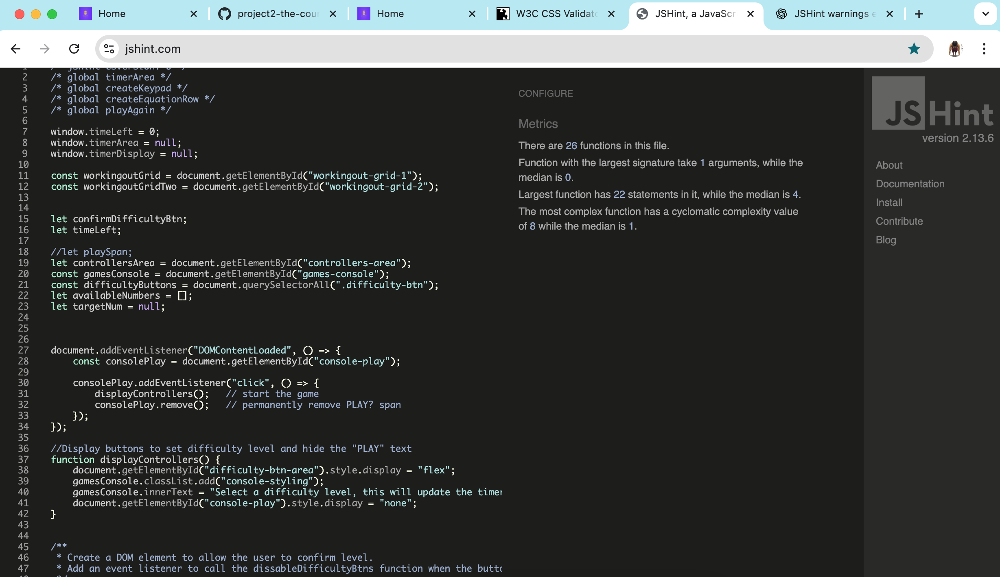
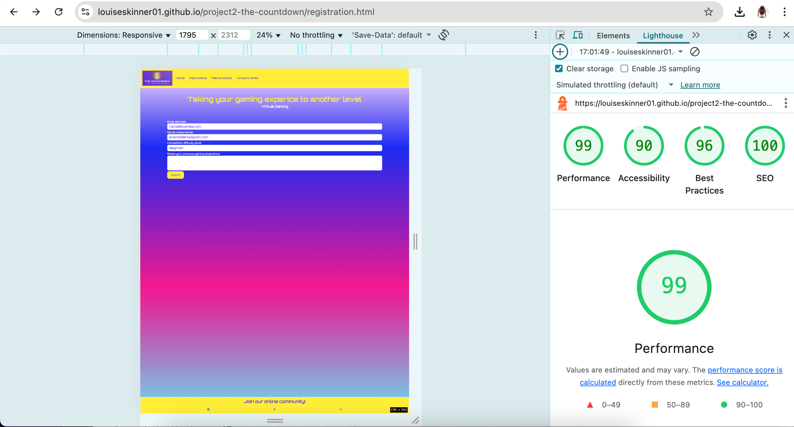
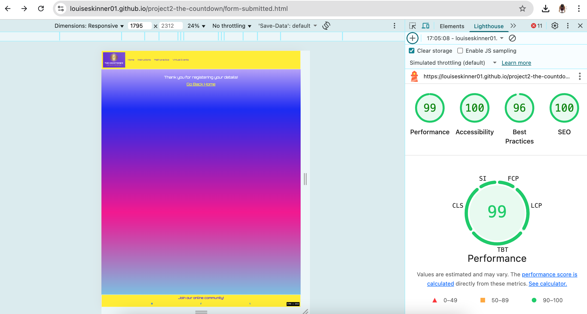

# Testing

> [!NOTE]  
> Return back to the [README.md](README.md) file.

## Rationale

The primary goal of testing was to ensure that the Countdown Game application performs consistently across multiple devices and screen sizes, maintaining both functionality and a smooth user experience.
Testing focused on performance, accessibility, and responsiveness.

## Approach
Testing was carried out to verify that the website functions as intended, is fully responsive, and provides an intuitive user experience.
All tests were conducted manually using a combination of Google Chrome DevTools, validation tools, and live user interaction testing.

## Methods

| Method                    | Description                                                                                                                                                                        | Tools Used                                                                                                                                |
| ------------------------- | ---------------------------------------------------------------------------------------------------------------------------------------------------------------------------------- | ----------------------------------------------------------------------------------------------------------------------------------------- |
| **Manual Testing**        | Each feature and button was manually tested to verify correct functionality. This included checking form submissions, button click responses, game flow, and orientation behavior. | Browser console, on-screen interaction                                                                                                    |
| **Responsive Testing**    | Tested using Chrome DevTools’ built-in device emulation. Ensured the layout adapts correctly to different screen widths and orientations.                                          | Chrome DevTools                                                                                                                           |
| **Cross-Browser Compatability Testing** | Tested in multiple browsers to ensure consistent design, color rendering, and interactivity.                                                                                       | Chrome, Firefox, Safari, Edge                                                                                                     |
| **Validation Testing**    | Used validation tools to check that the HTML, CSS, and JavaScript are free from syntax errors and follow best practices.                                                           | [W3C HTML Validator](https://validator.w3.org/), [W3C CSS Validator](https://jigsaw.w3.org/css-validator/), [JSHint](https://jshint.com/) |
| **Accessibility Testing** | Checked color contrast, font readability, tab navigation, and proper use of ARIA and semantic tags where applicable.                                                               | Chrome Lighthouse, manual checks                                                                                                          |
| **Performance Testing**   | Evaluated page load speed and responsiveness using Chrome Lighthouse.                                                                                                              | Chrome DevTools  Lighthouse                                                                                                              |

### Manual Tests (Defensive Programming)

⚠️ NOTE ⚠️
- Users cannot submit an empty form (add the `required` attribute)
- Users must enter valid field types (ensure the correct input `type=""` is used)
- Users cannot brute-force a URL to navigate to a restricted pages

| Feature Tested | Test Description                                   | Expected Outcome                                | Pass/Fail             |  Screenshot |
| ------------------- | ------------------------------------------------ | ----------------------------------------------- | ------------------- | ----------- |
| Start Game Button   | Clicked “PLAY?” and then “Start Game”            | Game begins, keypad becomes active              | ✅ Works | **Start button** **Game started**  |
| Orientation Warning | Rotated mobile device from portrait to landscape | Warning disappears and game becomes visible     | ✅ Works |  |
| Difficulty Buttons  | Selected “Easy / Medium / Hard”                  | Correct timer and equation difficulty displayed | ✅ Works |  |
| Keypad Input        | Clicked number keys and OK                       | Values entered correctly into equation input    | ✅ Works |  |
| Timer Countdown     | Started game at different difficulties           | Timer matched selected duration                 | ✅ Works |  |
| Play Aagin? Button     |  Clicked the button at the end of a game     | Resets the window bringing the user back to the clickable PLAY? text                  | ✅ Works | **Play again button** **Screen reloaded** |
Confirm difficulty |  Clicked the confirm button on different difficulty levels | Locks difficulty, updates the timer and removes buttons from further use  | ✅ Works          |  |
| Generate numbers   |  Clicked on the generate random numbers button.     |  Six random numbers displayed               | ✅  Works         |  |
Get target number  |    Clicked on generate a target number and then completed manual tests to ensute the number being generated was realistic (based on the random numbers in the stage before).   | Generates valid target (122–1017) with the set range.            | ✅ Works          |  |
Keypad input       |  Started a game and clicked each number on the built in keypad.           | Inputs digits and operators and is responsive and accurate         | ✅  Works         |  |
Undo button        | Clicked the undo button after submitting an equation | Clears last entry and restores numbers              | ✅  Works         | **Before undo** **After undo**|
Win condition      | Played multiple games until I won.            | A congratulations messages will appear in the console and the "Play Again" button will appear below.         | ✅  Works         |  |
Lose condition     | Played and lost many games.   | A congratulations messages will appear in the console and the "Play Again" button will appear below. | ✅ Works          |  |
Navigation (Burger-icon)     | Changed the screen size to viarious sizes and also clicked on the burger icon when testing on mobile and tablet devices.   | Appears when the screen ize is small and disappears (expanding into a full navigation bar) when the screen is large. | ✅ Works          | **Navbar toggle**  **Navbar expand**  |
Used numbers   | Played a game and input several equations using the random numbers generated in the earlier steps.     | Once a number has been used, it becomes unavailable and is struck through with a line. | ✅ Works          |   |

| Element Tested                | Test Description                   | Expected Outcome                        | Pass/Fail |
| -------------------------- | ---------------------------------- | ----------------------------- | --------- |
| Console area               | Displays messages clearly          | Text visible and styled       | ✅ Pass          |
| Buttons                    | Hover and click effects consistent | Colors and transitions smooth | ✅ Pass           |
| Orientation warning        | Displays on portrait mobile        | Hides automatically on rotate | ✅  Pass          |
| Placeholder text           | Color visible and readable         | Matches theme                 | ✅  Pass          |
| Font and color consistency | Uses variables correctly           | All consistent                | ✅  Pass        |

| User Story Tested | Test Description | Expected Outcome | Pass/Fail |
| --- | --- | --- | --- |
| “As a user, I want to choose my own difficulty level” | Visit the home page and click the PLAY? text on the screen, follow the instructions that lead to the select a difficulty level. Select a level by clicking on the button and then clicking the confirm difficulty button.  | The timer is updated to reflect the difficulty level that has been selected | ✅ Pass |
| “As a user, I want to clearly see the timer and generated numbers” | Follow the game instructions until the timer and random numbers are displayed. | Numbers displayed in the console are clearly formatted and the timer digits displayed to the left of the console are large and stand out. | ✅ Pass |
| “As a user, I want to input equations easily” | Follow the instructions, once a target number has been generated the built-in keypad will appear. Click the keypad buttons and see the numbers/operators appear in the input box. | Keypad input is smooth, responsive and displays the correct output into the corret area. 2| ✅ Pass |
| “As a user, I want feedback on results” | Once the game is in play (after the start game button has been clicked) the user can input equations via the keypad. If an equation is successful the result will appear at the bottom of the console else the console will display an error message. | Console updates with results, striked out used numbers and messages (error, win/lose). | ✅ Pass |
| “As a user, I want to play again quickly” | Click on the play again button which displays the home page so a difficulty level can be selected for a new game. | The window is reloaded, clearing all existing DOM elements and displays the PLAY? text| ✅ Pass |
| “As a user, I want to be prevented from entering invalid equations” | Use the keypad to enter invalid equations | The console displays an error message, the user is able to continue the game without it crashing. | ✅ Pass |
| “As a user, I want the orientation message to guide me on mobile” | Visit the deployed site using a mobile device. Visit each page on the website and rotate the device between landscape and portrait. | Warning shows in portrait, disappears in landscape. | ✅ Pass |
| “As a user, I want used numbers to be tracked correctly” | Use the keypad to enter values (numbers from generated numbers or results) into the input box. | Once a number is used, it becomes unavailable and is struck with a line through it. | ✅ Pass |
| “As a user, I want the game to reset properly when I play again” | At the end of a game, click the "play again" button. | The user is presented with the home page PLAY? text. | ✅ Pass |
| “As a user, I want to be challenged in a realistic way” | Perform manual calculations on the target number and the random numbers produced to ensure the target number is always achievable. | Target numbers can always be solved by using some or all of the 6 randomly generated numbers. | ✅ Pass |

### Responsiveness
Google Chrome DevTools was used extensively to simulate various device viewports, including popular smartphones, tablets, and desktop resolutions. This allowed for a controlled testing environment to verify that the layout, interactive elements, and overall responsiveness behaved as intended under different conditions.

Particular attention was given to:

Responsive design: Ensuring all elements (buttons, grids, and text) resize and reposition correctly.

Touch interactions: Confirming buttons and inputs respond properly on smaller screens.

Orientation changes: Validating that the landscape and portrait orientation logic functions correctly on mobile devices.

Visual consistency: Checking that colours, fonts, and spacing remain aligned with the intended design across all viewports.

By testing through Chrome DevTools, I was able to efficiently identify and resolve layout shifts, overlapping elements, and scaling issues before deployment. This ensured the final build delivered a clean, accessible, and user-friendly experience on all supported devices.

I've tested my deployed project to check for responsiveness issues.

| Page | Mobile (Portrait) | Mobile (Lanscape)| Tablet | Laptop | Desktop | 
| --- | --- | --- | --- | ---| --- |
| index.html (landing page) |  |  |  |  |  | 
| index.html (during Play) | NA |  |  |  |  |   
| instructions.html |  |  |  |  |  | 
| practice.html |  |  |  |   |  |
| registration.html |  |    |  |  |  | 
| form-submitted.html |  |  |  |   |  |  
| 404.html |  |  |  |   |  |

| Device                  | Screen Size (Approx.) | Orientation Tested   | Result                                                              |
| ----------------------- | --------------------- | -------------------- | ------------------------------------------------------------------- |
| iPhone SE               | 375 × 667 px          | Portrait / Landscape | ✅ Fully functional and responsive                                   |
| iPhone 12 Pro           | 390 × 844 px          | Portrait / Landscape | ✅ Layout scales correctly, all buttons accessible                   |
| iPhone 14 Pro Max       | 430 × 932 px          | Portrait / Landscape | ✅ Smooth transition between orientations                            |
| Pixel 7                 | 412 × 915 px          | Portrait / Landscape | ✅ Responsive elements adjust correctly                              |
| Samsung Galaxy S8+      | 360 × 740 px          | Portrait / Landscape | ✅ No layout distortion observed                                     |
| iPad Air                | 820 × 1180 px         | Portrait / Landscape | ✅ Layout adjusts well; game content centered                        |
| iPad Mini               | 768 × 1024 px         | Portrait / Landscape | ✅ Fully functional; text and button scaling appropriate             |
| Surface Pro 7           | 912 × 1368 px         | Landscape            | ✅ Desktop-style layout renders correctly                            |
| Desktop (1080p)         | 1920 × 1080 px        | Landscape            | ✅ All components display as intended with balanced spacing          |
| Large Display (2560px+) | Variable              | Landscape            | ✅ Tested using media query breakpoint; scaling remains proportional |

## Testing Summaries 

### Cross-Browser Compatatbility

To ensure a consistent and accessible user experience across all devices and browsers, the project was thoroughly tested using Google Chrome DevTools. This allowed emulation of multiple devices (iPhone, Samsung Galaxy, iPad, Surface Duo, etc.) and responsive breakpoints to verify that all layout, interaction, and orientation features behaved correctly.

Cross-browser compatability testing was performed manually in the following browsers:
 - Chrome
 - Firefox
 - Safari 
 - Edge
 - Opera

 Each browser was checked for layout consistency, JavaScript functionality (such as keypad interactivity and timers), and color rendering.

The goal was to confirm that the web app provides the same smooth gameplay and responsive UI on both desktop and mobile environments, regardless of platform or browser engine.

I've tested my deployed project on multiple browsers to check for compatibility issues.

| Page | Chrome | Firefox | Safari | Edge | Opera | Notes
| --- | --- | --- | --- | --- | --- | --- |
| [Index.html] (Home - Rotate Warning)  |  |  |  |  |  | Works as expected |
| Index.html (Home - PLAY?)  |  |  |  |   |  | Works as expected |
| Index.html (Home - During Play)  |  |  |  |  |  | Works as expected |
| Instructions.html |  |  |  |   |  | Works as expected |
| Practice.html |  |  |  |  |  | Works as expected |
| Registration.html |  |  |  |   |  | Works as expected |
| Form-submitted.html |  |  |  |   |  | Works as expected |
| 404.html |  |  |  |  |  | Works as expected |

### Validation summary

#### HTML

I have used the recommended [HTML W3C Validator](https://validator.w3.org) to validate all of my HTML files.

| Directory | File | URL | Error ⚠️ | Fixed ✅ | Notes |
| --- | --- | --- | --- | --- | --- |
| root | [404.html](https://github.com/Louiseskinner01/project2-the-countdown/blob/main/404.html) | [HTML Validator](https://validator.w3.org/nu/?doc=https://louiseskinner01.github.io/project2-the-countdown/404.html) |  |  | Examples of erros that were preventing this page from passing validation are: stray / at the end of tags e.g `    <meta charset="UTF-8" />`. By removing the unnecessary white space, the error was easily fixed. |
| root | [form-submitted.html](hhttps://github.com/Louiseskinner01/project2-the-countdown/blob/main/form-submitted.html) | [HTML Validator](https://validator.w3.org/nu/?doc=https://louiseskinner01.github.io/project2-the-countdown/form-submitted.html) |  |  | Errors such as duplicate classes, typos where additional " were used and stray `</i>` tags in the footer where preving this page from passing.  |
| root | [index.html](https://github.com/Louiseskinner01/project2-the-countdown/blob/main/index.htmll) | [HTML Validator](https://validator.w3.org/nu/?doc=https://louiseskinner01.github.io/project2-the-countdown/index.html) |  |  | stray `</i>` tags in the footer was a common theme throughout, and was the only error identified whilst testing this page. |
| root | [registration.html](https://github.com/Louiseskinner01/project2-the-countdown/blob/main/registration.html) | [HTML Validator](https://validator.w3.org/nu/?doc=https://louiseskinner01.github.io/project2-the-countdown/registration.html) |  |  | There was an anchor tag that was a child element of the submit button: this is not good practice. To fix this I removed the anchor tag and added a url to the form action attribute in to the registration form like this `action="form-submitted.html"`. |
| root | [practice.html](https://github.com/Louiseskinner01/project1-lskinner/blob/main/nutrition.html) | [HTML Validator](https://validator.w3.org/nu/?doc=https://louiseskinner01.github.io/project2-the-countdown/practice.html) |  |  | Stray `</i>` was the culprits. |
| root | [instructions.html](https://github.com/Louiseskinner01/project2-the-countdown/blob/main/instructions.html) | [HTML Validator](https://validator.w3.org/nu/?doc=https://louiseskinner01.github.io/project2-the-countdown/instructions.html) |  |   | The main cuplprits here were stray `</i>` and `
` tags. |

#### CSS
I have used the recommended [CSS Jigsaw Validator](https://jigsaw.w3.org/css-validator) to validate all of my CSS files.

| Directory | File | URL | Screenshot | Notes |
| --- | --- | --- | --- | --- |
| assets | [stylesheet.css](https://github.com/Louiseskinner01/project2-the-countdown/blob/main/assets/css/stylesheet.css) | [CSS Validator](https://jigsaw.w3.org/css-validator/validator?uri=https://louiseskinner01.github.io/project2-the-countdown/assets/css/stylesheet.css&output=html) |   | When validating my CSS, the file upload and copy-and-paste methods passed with no errors. |
| assets | [workingout-grid.css](https://github.com/Louiseskinner01/project1-lskinner/blob/main/assets/css/new-stylesheet.css) | [CSS Validator](https://jigsaw.w3.org/css-validator/validator?uri=https://louiseskinner01.github.io/project2-the-countdown/assets/css/workingout-grid.css&output=html) |   | same as above|
| assets | [other-styling.css](https://github.com/Louiseskinner01/project1-lskinner/blob/main/assets/css/new-stylesheet.css) | [CSS Validator](https://jigsaw.w3.org/css-validator/validator?uri=https://louiseskinner01.github.io/project2-the-countdown/assets/css/other-styling.css&output=html) |   | same as above  |
| assets | [global-variables.css](https://github.com/Louiseskinner01/project1-lskinner/blob/main/assets/css/new-stylesheet.css) | [CSS Validator](https://jigsaw.w3.org/css-validator/validator?uri=https://louiseskinner01.github.io/project2-the-countdown/assets/css/global-variables.css&output=html) |   | same as above |

#### JS
I have used the recommended [JSHint](https://jshint.com/) to validate all of my CSS files.

| Directory | File | Screenshot | Notes |
| --- | --- | --- | --- | 
| assets | [script.js](https://github.com/Louiseskinner01/project2-the-countdown/blob/main/assets/js/script.js)  | | I added `/* jshint esversion: 6 */` to the top of my js files and that reduced the warnings by a significant amount. |
| assets | [workingout-grid.js](https://github.com/Louiseskinner01/project2-the-countdown/blob/main/assets/js/workingout-grid.js) |    | ` /* jshint esversion: 11 */` `/* exported createEquationRow, createKeypad */` |
| assets | [orientation.js](https://github.com/Louiseskinner01/project2-the-countdown/blob/main/assets/js/orientation.js) |   | ` /* jshint esversion: 6 */` |

## Performance 
### Lighthouse Performance

I've tested my deployed project using the Lighthouse Audit tool to check for any major issues. Some warnings are outside of my control, and mobile results tend to be lower than desktop.

| Page | Mobile | Desktop |  Notes &nbsp;&nbsp;&nbsp;&nbsp;&nbsp; |
| --- | --- | --- | --- |
| Home |  |  |This is the first page that was tested so it's at this stage that the most effective changes were made. Meta tags were added to help improve SEO. The previous image that sat in the navbar was resized to help improve the page load, this had a positive impact but was minute. Aria labels were added to the footers where the social icons are. It is also at this stage that the fontawesome script tag was removed from html pages and replaced with a cdn link, speeding up the page load and improving the overall performance.|
Instructions |  |  | There were a few minor issues related to accessibility that had a negative impact on the performance.  |
| Math Practice |  |  | Testing was still showing that the image in the navbar could be smaller in size, plus feedback on the readability of the image initiated me to change the image completely. Once I created a new image, resized it using tinyPNG and committed it into the project, the performance improved, not only on this page but all previously tested pages. |
| Virtual Events |  |  | The first set of lighthouse tests for the mobile site came back with a performance of 84%. After changing the navbar image and adding a good alt description the performance improved. |
| Form-submitted |  |  | Due to the errors found and corrections made on previous pages, there wasn't anything major affecting this page, resulting in a good performance level. | |
| 404 |  |  | Same as above. |

### Accessibility Summary 
 
| Test                                                             | Result |
| ---------------------------------------------------------------- | ------ |
| The web app follows the WCAG (web content accessibility guidelines) 2.1 standards                          |     |
| Text size and spacing adjustable                                 | ✅      |
| Interactive elements clearly labeled and accessible via keyboard | ✅      |
| ARIA labels provided for key game sections                       | ✅      |
| Orientation and responsiveness maintained for screen readers     | ✅      |

## Bugs / Fixes

| Issue      | Cause  | Solution    | Status  |
| --------------------------------------------- | ------------------------------ | -------------------------- | ------- |
 Keypad not resizing correctly                 | Flexbox conflict               | Adjusted grid layout                   | ✅ Fixed |
| Timer not resetting on replay                 | Countdown interval not cleared | Added `clearInterval()`                | ✅ Fixed |
| “Play?” span reappeared on orientation change | Re-triggered event listener    | Added `.remove()` on click             | ✅ Fixed |
| Placeholder color not applying                | CSS selector conflict          | Used `::placeholder` with `!important` | ✅ Fixed |
| Buttons remaining visible when the screen size is reduced or mobile device in put into portrait          | Missing DOM elements in the orientation.js file       | Added `const controllerBtnsContainer = document.getElementById("controllers-area");` & `controllerBtnsContainer.classList.add("hidden");` in the IF condition, with `controllerBtnsContainer.classList.remove("hidden");` in the else condition| ✅ Fixed |
### Known/Existing Issues

| Issue                 | Screenshot |
| --------------------- | --- | 
 When an equation has been undone using the undo button, the numbers that had been previously used, remain striked out. |    |
 There is an issue with the opacity of the **equation input** when the game is in play. The background of the **equation input** should be white and remain white for the duration of play, however when playing The Countdown on a mobile device the **equation input** loses opacity (turned to a greyish colour). |**Laptop**  **Mobile**  |

> [!IMPORTANT]  
> From my testing I have not identified any bugs other than the ones listed in the above sections. If you identify any new bugs please feel free to contact me and/or clone the project and fix the issue.